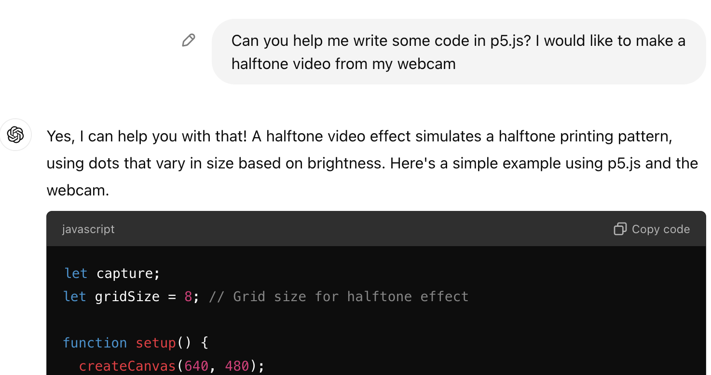

import Callout from "../../../components/Callout/index.astro";

## 何を作るのか?

このチュートリアルでは、ジェネレーティブAIを使用してp5.jsコードを書く方法を学びます — ヒントと警告も含みます。また、アーティストやp5.jsを使用して創作活動をする人々にとって、AIに対する批判的な視点が重要である理由も学びます。このチュートリアルはあなた(p5.jsでの作業方法を増やしたい、すでにジェネレーティブAIを使用してコードを書いている)のためのものです。



## 使用方法：コード生成AI

ChatGPTのようなテキスト生成AIツールについてはご存知かもしれません。人間の知性を引き出しているように見えるかもしれませんが、実際には統計を使用しているだけです。以前分析した膨大なデータに基づいて、次に現れる可能性がもっとも高い単語、文字、またはピクセルを予測しています。

これらは非常に説得力のある方法でこれを行い、コードさえも生成できます。すべてのコードを書いてもらえばいいのではないか?そうであれば、このようなチュートリアルは必要ないと思うかもしれません。

しかし、注意点があります: 欠陥のあるコード、偏見のあるコード、そして退屈なコードになってしまう可能性が非常に高いのです。

このチュートリアルでは、コード作成AIテキストジェネレーターを使用したp5.jsスタイルのクリエイティブコーディングのプロセスを説明します。その過程で、AIの使用に関するヒント、警告、そしてクリティカルな考察を共有します。これらのコメントは、ヒントには「Try This!」、注意点には「注意」、思慮深い考察には「重要な文脈」というフラグが付けられています。

このチュートリアルは、AIを創造的かつ思慮深く使用することに焦点を当てた4部構成のシリーズの第1部です。これらを自分自身のAIシステムのクリティカルな探求に役立ててください:

- パート2: [プロンプトバトル](./criticalai2-prompt-battle/)  
- パート3: [感情データセットエクスプローラー](./criticalai3-sentiment-dataset-explorer/)  
- パート4: [ノーAIチャットボット](./criticalai4-no-ai-chatbot/) 


## 作り方

### ステップ1. アイデアを説明する

p5.jsで作成したいものを選びます。できるだけ多くの詳細を想像して、自分のアイデアを書き出してください。異なる方法で説明してみてください:どのように見えるか?何をするのか?どのように機能するのか?

この例では、私が想像したけれども他では見つけられなかったものを作ることにしました。GPTへの基本的なプロンプトとして、このように書きます: 

`ウェブカメラの映像をハーフトーン調に変換し、その領域の暗さに基づいてドットのサイズを変更する。`


<Callout>
最初は小規模なプロジェクトにとどめましょう。アイデアの異なるバージョン、シンプルなバージョンと複雑なバージョンはありますか?それらを別々に書き出してください。例えば、後で追加したい機能がいくつかあります: 

`- GIFとして出力する`   
`- グレースケールの代わりに2色のハーフトーンピクセルを作成する`

また、コーディングを進めながら新しいアイデアが浮かぶかもしれません。
</Callout>

この例は[p5.js Web Editor](https://editor.p5js.org/sarahciston/sketches/LiHcPXdv1)で試すことができ、作成に使用した[チャットスレッド](https://chatgpt.com/share/67094820-dc28-8003-bd34-14cc1e7b4572)も参照できます。

<Callout title="重要な文脈">
プロジェクトでGPTツールを使用するのはいつで、いつスキップするのでしょうか?ChatGPTのクエリは、Googleの検索の約10倍の電力を必要とします（O'Brien 2024）。時にはコードの課題はGoogleやStackOverflowで簡単に見つけられることもあります。時には友人に電話して一緒に解決するほうが良いこともあります! 
</Callout>

### ステップ2. ツールを集める

まず、好みのチャットベースのAIツールにログインします。選択肢には、[OpenAIのChatGPT](https://chat.openai.com)、[Replit Ghostwriter](https://replit.com/)、[Blackbox.ai](https://www.blackbox.ai/)などがあります — これらはすべて限られた無料アクセスがありますが、無料版でもできることはたくさんあります。

<Callout title="注意">
課金されたくない場合は、無料プランを使用していることを確認してください。一部の有料プランは無料版に比べてより高度なモデルを使用していますが、無料版でも強力なプロジェクトを作成できるはずです。
</Callout>

<Callout title="重要な文脈">
残念ながら、これらのAIツールのいずれもオープンソースではなく（執筆時点で）、コーディング用のオープンソースまたはオープンデータのAIツールを知りません。これらのクローズドソースのプロプライエタリツールは、GitHubのようなオープンソースプラットフォームからスクレイピングしたデータを使用してツールをトレーニングします。
</Callout>

<Callout>
これらのAIツールにウェブインターフェースからアクセスするだけでなく、IDE（Microsoft Visual Studioのようなコーディングプログラム）内からもいくつかのツールを使用できます。拡張機能やウィジェットをダウンロードすることで、これには利点と欠点があります。

例えば、IDEウィジェットは、コーディング中にオートコンプリートの提案を提供することがあります。これにより、使用したい関数名を見つけるのに役立つかもしれませんが、プロジェクトの方向性を過剰に決定づける可能性もあります。今後のこのコレクションの他のチュートリアルでは、p5.jsとさまざまなAIツールのAPI（アプリケーションプログラミングインターフェース）を使用して、標準のプリセット以外のカスタムインターフェースを作成します。

既存のツールを操作したり、自分自身のツールを作成したりすることを学ぶことが、p5.jsの本質です! 
</Callout>

<Callout title="注意">
テキスト生成AIは、GitHubやStackOverflowのようなプラットフォームから公開されているコードをスクレイピングして作成されています。これは、生成されたコードが他のコーダーからのものであることを意味します。したがって、それは完璧でなく、ユニークでもなく、動作することが保証されているわけではありません。また、これらのAIツールと一緒にGitHubを使用している場合、自分のコードが次のAIツールのトレーニングに使用されるのを保護することは非常に難しいです。
</Callout>

これを念頭に置いて、ツールを選択したら、通常のテキストチャットプロンプトのようにプロンプトを入力して始めることができます。この例では、ChatGPTの無料プランを使用し、GPT-4oモデルを実行しています。

### ステップ3. GPTにp5.jsコードを生成させる

一時停止。

ChatGPTにプロジェクトのアイデア全体を一度にプロンプトするのではなく、部分に分けてプロンプトしましょう。作成したいプロセスのすべての部分を知らなくても大丈夫です — それが助けを求める理由です。

これを行うことで、私たちが作ろうとしているものについてより理解を深め、より一般的でなく、プロジェクトに合わせたコードを受け取ることができます。

p5.jsでコーディングしていることを忘れずに伝えましょう! 

`p5.jsでプロジェクトをコーディングする手助けをしてください。機能を説明し、それを追加してもらいたいです。`  
`- まず、ウェブカメラの映像をインポートする`  
`- 映像をピクセルに変換する`  
`- ピクセルをドットに変換する`  
`- ピクセルの明るさとコントラストに基づいてドットのサイズを変更する`

<Callout>
コーディングのステップを記述する際に、実際にコードを書くのではなく、擬似コードで書き出してみてください。これにより、コーディングのステップをより小さく、プログラム的なステップに分けることができます。例えば、映像処理のステップを次のように変更できます: 

`- ウェブカメラの映像をインポートする`  
`- 映像の各フレームにアクセスする`  
`- 各映像フレームをピクセルに変換する`  
`- 各フレームの各ピクセルをドットにする`  
`- ドットをグレースケールに変換する`  
`- ドットのサイズを暗さに基づいて変更する。暗いピクセルは大きなドット、明るいピクセルは小さなドットになります。`
</Callout>

<Callout>
各ステップのコードを入力し、実行し、比較してみてください。これにより、コードがどのように機能するかをインタラクティブに学び、新しいアイデアを試す手助けになります。

提供された回答をレビューしてから、それを使用するかどうかを決定してください。コードには、あなたが知っているよりも高度な技術が含まれている場合や、実際に必要なものよりも高度な技術が含まれている場合があります。
</Callout>

<Callout title="重要な文脈">
また、その解決策があなたにとって正しい解決策であるとは限りません。あなたの擬似コードは、彼らが取ったステップとどのように比較されますか?問題を解決する方法は常に複数あります。
</Callout>

### ステップ4. コードをニーズに合わせて適応させる

出力されたコード結果をp5.jsエディタまたは好みのIDEに持ち込みます。可能であれば、コードを手で再入力してください。これにより、コードを理解し、プロジェクトに適合させることができます。

<Callout>
それが動作するとは限りません。自分の知識を使って適応させ、プロジェクトのニーズに合わせて再作業することを恐れないでください。

最初は、あなたが望むように動作しないかもしれません。最初は全く動作しないかもしれません。自分のコーディングスキルを信じて、いじることを恐れないでください。
</Callout>

<Callout title="重要な文脈">
ChatGPTや他のAIを使用する際は、必ず引用してください。使用した日付や可能であればプロンプトを含めてください。モデルのバージョンや、システムの使用方法に関連する他の詳細も含めることが重要です。これは、あなたのコードを読む将来の読者が、どのように作成したのかを理解するのに役立ちます。また、引き出したコードや例を引用する習慣を持つことも重要です — 人間のものであれ、そうでなかれ — たとえ最終的にコードを書き直したとしても。
</Callout>

### ステップ5. フォローアップの質問をする

プログラムが何をしているのか理解できない部分があれば、ChatGPTに助けや説明を求めることができます。プログラムの特定の行を指摘して、それが何をするのか尋ねることもできます。また、一般的な概念がどのように機能するのか、またはどのように実装されているのかを説明するようにChatGPTに促すこともできます。

<Callout>
生成AIは、他の場所で見つけたコードの概念を説明したり、あなたが書いたコードのトラブルシューティングを手伝ったりできます。あなたのコードが正しく動作していない理由を尋ねてみてください。
</Callout>

それでも正しい答えが得られないかもしれません。小さなセクションについて尋ねたり、異なる方法で尋ねたりしてみてください。追加のコードや回答が機能するとは限りません。GPTを自分自身よりも信頼しないでください。Wikipediaよりも信頼しないでください。

<Callout title="重要な文脈">
偏見、公平性、表現に注意してください。生成されたテキストと同様に、他の人と協力することで偏見に対処できます。私たちは皆間違いを犯しますが、他の視点を取り入れることで、私たちの考えのギャップを見つけるのに役立ちます。
</Callout>

### ステップ6. ChatGPTと自分の能力を組み合わせてプロジェクトを強化する

生成したコードに変更を加えるプロンプトを試すことができます。これには、バグ修正、追加機能の追加、見た目の調整などが含まれます。

ハーフトーンビデオのために、ビデオの基本的なトーンを調整できるようにしたいので、次のプロンプトを試してみましょう:

`スライダーで明るさとコントラストを調整できるようにする`

ChatGPTに調整を手伝ってもらった後でも、プログラムが自分の望むように見えないかもしれません。しかし、あなた自身で調整をし、正確に望むものにできると感じるべきです。コードを読み返して（自分で入力したのですよね?）、どのようにカスタマイズや拡張ができるかを探ってみてください。

例えば、ハーフトーンのドットが全体的に大きすぎると感じた場合、グローバル変数`gridSize`の値を調整してみてください。小さい数値は、一般的に細かい解像度の画像を作成します。

また、よりカラフルにすることも試みることができます: 

`グレースケールの代わりに2色のハーフトーンピクセルを作成する`

興味深いことに、これはまだ灰色に見えます。なぜなら、GPTが私たちのピクセルに選んだ2色は黒と白だったからです! 再度GPTに尋ねるのではなく、自分でやってみましょう。

`let fillColor = isDark ? 0 : 255;`という行を見つけてください。これは、ドットを塗りつぶすために使用する2つの色を決定します。まず新しい塗りつぶし色を作成し、その後`fillColor`変数を更新してみましょう:

```js
// let fillA = color(0,0,0) //黒
// let fillB = color(255,255,255) //白
let fillA = color(255,0,0) //赤
let fillB = color(0,255,0) //緑
let fillColor = isDark ? fillA : fillB;
```

背景を灰色から黒または白に変更して、より目立たせることもできます。

```js
function draw() { 
   background(255)   
...}
```

<Callout title="注意">
事例として：GPTは誤りを犯します。2色の機能を追加したとき、GPTは私たちがドットのサイズを異なるものにするという元のリクエストを失ったようです。実際、変動は非常に小さかったのは、設定したグリッドサイズが小さかったからです。コードと以前のボットとの会話を読み返すことで、問題を診断し、私が好む解決策を見つけるのに役立ちました。このようなことに注意し、提供された解決策を組み合わせて、実際に必要な解決策を見つけるために自分のコーディング能力を活用してください。
</Callout>

次に、ビデオをGIFとして出力するという追加機能を追加しましょう。ここでChatGPTは実際には間違った、複雑で効果的でないコードを提供しますが、p5.jsには[`saveGif()`](/reference/p5/saveGif/)というシンプルな組み込み関数があります。このコードをスケッチの最後に追加できます: 

```js
function keyPressed() {
  if (key === 's') { 
	saveGif('halftoneGif', 3);  
  }  
}
```

この例では、`s`はGIFを保存するために押すキーで、`halftoneGif`は保存されるGIFの名前で、`3`はキャプチャする秒数です。

<Callout title="重要な文脈">
ChatGPTが生成したハーフトーンビデオの例を持って、結果はあなたが想像したビジョンとどのように比較されますか?それをどのように修正して、よりあなたが想像したものに近づけることができますか?もしあなたがこの問題を「ゼロから」書いていたら、どのように解決しますか?
</Callout>

<Callout>
実験を続けてください。小さな部分を組み合わせて大きな部分を作るためにモジュール式で作業してください。ChatGPTと他のリソースの間を行き来し、さまざまな方法を探求して、どこに行く必要があるかを見つけてください。
</Callout>

### ステップ7. ChatGPTと批判的かつ創造的に対話するさまざまな方法を試す

新しいコードを生成するだけでなく、ChatGPTやそのようなツールを使用して、クリエイティブコーディングに関連する他の多くのことを行うことができます。コンピュータサイエンスの学生がChatGPTを使用した方法に関する研究では、もっとも一般的なタスクは次のとおりです: 
* 理解を深めたいプログラミングの概念を説明してもらう
* それらの概念を説明するのに役立つコード例を提供してもらう

また、エラーメッセージを解釈したり、既存のコードをチェックして最適化、デバッグ、または特定のセクションを明確にするのにも使用されました（Ma 2024）。

例えば、次のようなプロンプトを試してみることができます: `ここにp5.jsのコードがあります。効率的に動作させるためのアイデアを提供してください…` その後、あなたのコードを貼り付けます。

この研究の学生たちはまた、「ChatGPTは必ずしも正しい答えや必要な答えを提供するわけではない、特にプログラミングの文脈では、複数の解決策が存在する」と警告しました（Ma 2024, 6）。

### ステップ8. ボーナス：コード生成を創造的な出発点として使用する

GPTにコードを生成させるのではなく、あなた自身がコードを書くためのプロンプトを作成させることもできます。素早いコード演習を求めて、あなたの想像力を刺激したり、スキルを練習するためのドリルを作成させることができます。その後、あなたがコードを作成します。例えば:

`p5.jsを使用してウェブページを作成するためのクリエイティブコーディング演習のプロンプトを作成してください`

<Callout>
コードジェネレーターを使用して、コードに関わりながらの学ぶ時間を省くのではなく、より創造的になり、深く掘り下げるための補助として使ってください。これらの技術は、p5.jsや他のプログラミング言語、また非コードテキストを生成する際にも使用できます。それを使って、より多くを学ぶ力を得てください! 
</Callout>

## まとめ

### クリティカルなAIの使用におけるクリエイティブコーディング

このチュートリアルは、生成AIをソース素材として意識的に使用することの重要性を強調しています。AIが正しいということを前提にはできません。なぜなら、それは何百万ものクラウドソースのテキストから集められた結果だからです。生成AIのバイアスは最終的に最適化されるべき欠陥ではなく、AIが設計されている方法の根本的な要素です。

これは、私たちがWikipediaを批判的に読むことを学んだのと似ています。Wikipediaが伝統的な百科事典のように機能するとは信じないでください。Wikipediaを参考するときに追加の代替ソースを探すように、プログラミングや他の情報に関してもChatGPTに依存しないでください。

生成AIは、すでに基本的なコーディングスキルを持っている場合、迅速に学ぶための便利なツールとなる可能性があります。一方で、まったくの初心者には向かないかもしれないし、専門家の仕事の代わりにはなりえません。また、唯一のツールとして使用するべきではありません。

「ただ動作する」ものが必要なとき — 環境に害を及ぼしたくない場合は — ChatGPTを引き出さないでください。友人に電話してください。

### クリティカルAIの「クリティカル」とは何か?

クリティカルとは否定的であることではなく、思慮深く、さまざまな視点を採用することを意味します。クリティカルな視点は、私たちが技術的および創造的な選択をする際に、私たちの価値観や目標に合ったものを選ぶのに役立ちます。それは、影響を受けることに対して意識的で責任を持ち、適応することを助けます。

AIを批判的に使用することは、その出力がどこから来ているのか、どのように作られているのかをより理解することを意味します。これは、これらのチュートリアルの各セクションでAIを扱うための実践的なスキルを学ぶ一部です。

また、AIの影響を理解することによって、AIツールを社会的および技術的な複雑なシステムの一部として理解することを意味します。AIは、データの搾取、労働の搾取、誤情報、差別、環境への影響など、特定の懸念を強調します（Atairu 2024）。

エイミー・コー教授は次のように述べています。「クリティカルな視点は、コンピュータサイエンスが個々の生活を形作る大きな可能性と力を持っていることを受け入れますが、その力の適用についても疑問を呈し、その力を持つのは誰か?どのようにその力を分配すべきか?を考え、持つ者の責任を主張します。」（Ko et al. 2024）。

## 謝辞

これらのチュートリアルは、Google Season of Docs 2024の一環として作成されました。メンター: mily Martinez. アドバイザー: Minne Atairu.

## 参考文献

Atairu, Minne. 2024. "AI for Art Educators." *AI for Art Educators*. [https://aitoolkit.art/](https://aitoolkit.art/)  

Ko, AJ, Beitlers A, Wortzman B, et al. 2024. *Critically Conscious Computing: Methods for Secondary Education*. [https://criticallyconsciouscomputing.org/](https://criticallyconsciouscomputing.org/)  

Ma, Boxaun, Li Chen, and Shin'ichi Konomi. 2024. “Enhancing Programming Education with ChatGPT: A Case Study on Student Perceptions and Interactions in a Python Course.” *arXiv*. [http://arxiv.org/abs/2403.15472](http://arxiv.org/abs/2403.15472).  

ml5.js “Ml5.Js | Friendly Machine Learning for the Web.” [https://ml5js.org/](https://ml5js.org/)  

OpenAi. “Chat Playground.” [https://platform.openai.com/playground/](https://platform.openai.com/playground/)  

O'Brien, Isabel. 2024. “Data Center Emissions Probably 662% Higher than Big Tech Claims. Can It Keep up the Ruse?” *The Guardian*, September 15, 2024, sec. Technology. [https://www.theguardian.com/technology/2024/sep/15/data-center-gas-emissions-tech](https://www.theguardian.com/technology/2024/sep/15/data-center-gas-emissions-tech)  