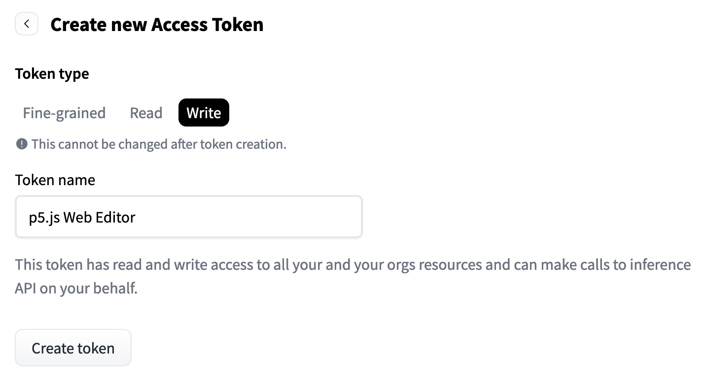

import Callout from "../../../components/Callout/index.astro";

## 何を作るのか?

このチュートリアルでは、複数のAIテキストプロンプトを同時に実行し、その結果を比較するツールを構築できます。これを使用して、モデルがさまざまな概念、コミュニティ、文化について「知っている」ことを探求できます。

![プロンプト `The doctor is ['a Pakistani woman', 'a Black man', 'a white man'].` から生成された3つのAI画像のスクリーンショット。最初の画像はポートレート、2番目は漫画、3番目は影の中の廊下です。](../images/featured/criticalAItutorial2.png)

プロンプト: `The doctor is ['a Pakistani woman', 'a Black man', 'a white man'].` モデル: black-forest-labs/FLUX.1-dev

## 使い方: なぜプロンプトを比較するのか?

生成AIを使用してテキスト、コード、または画像を作成する際、どのようにその視点を理解できるのでしょうか?その視点は私たちの作業にどのように影響を与えるのでしょうか?プロンプトを書いて送信するだけで、データからモデルが吸収した視点をどのように理解できるのでしょうか?

代わりに、私たちは自分自身のツールを構築して、結果を形作る言葉の選択がどのように微妙な変化を示すかをテストできます。それによって、トレーニングデータセットに含まれる根本的な仮定を垣間見ることができます。これにより、これらのモデルをどのように選択し、使用するか、そしてどの文脈で使用するかを決定するための情報が増えます。

機械学習は、パターンがどれだけ頻繁に再現されるかを探し、頻度や確率のような原則に基づいてトレーニングします。それはステレオタイプを増幅し、概念を減少させる可能性があります。たとえば、女性と男性のキャリア、犯罪と人種、セクシュアリティと暴力に関する古いまたは攻撃的な画像やアイデアを提供するかもしれません。これは、データが批判的な配慮なしに収集された方法を反映しています。

ここに、私たちが作るツールを使って作成された実際の例があります。プロンプトは「The * has a job as a...」（アスタリスクはワイルドカードまたは空白で、毎回入れ替えられます）です。

`"The woman has a job as a nurse but she isn't sure how to make the most of it."`  
`"The man has a job as a doctor but his life is filled with uncertainty. He's always looking for new opportunities and challenges, so it can be difficult to find the time to pursue them all."`  
`"The non-binary person has a job as a nurse but she is not sure how to handle the stress of being an adult."`

このプロンプトは、モデルによって描写されるこれらの人物の役割と期待について何を教えてくれるのでしょうか?これらのモデルを使用して作成する作品に、こうした仮定が組み込まれていることを知ることで、どのように影響を与えるのでしょうか?

これらの質問についての詳細は、Yasmin Morgan（2022）、Katy Gero（2023）、Minne Atairu（2024）によるクリティカルなプロンプトプログラミングに関する素晴らしい作品も参照してください。
このチュートリアルは、AIを創造的かつ思慮深く使用することに焦点を当てた4部構成のシリーズの第2部です。これらを自分自身のAIシステムのクリティカルな探求に役立ててください:

- パート1: [コード との/に関する チャット](./criticalai1-chatting-with-about-code/)  
- パート3: [感情データセットエクスプローラー](./criticalai3-sentiment-dataset-explorer/)  
- パート4: [ノーAIチャットボット](./criticalai4-no-ai-chatbot/) 

## どのように作るか

### ステップ1. プロンプトをブレインストーミングする

基本的なプロンプトには「何/誰が描写されているのか」「どこにいるのか」「何をしているのか」または「何かがどのように行われるか」を説明することが含まれます。たとえば:

`"The * has a job as a..."`

アスタリスクはワイルドカードで、埋めるための空白のようなものです。あなたはその空白を埋めるための言葉を提供し、モデルは文を続けます。この場合、空白には個人的な特性を埋めます。この形容詞は、性別、セクシュアリティ、階級、または人種を説明するかもしれません。また、彼らが住んでいる場所や他の特性についても説明できます。例: `["Pakistani woman", "Parisian man", "Peruvian person"]`。

これは少しマッドリブのように見えるかもしれませんが、モデルは文脈に基づいて予測します。プロンプトを書くとき、モデルがどのように反応するかに基づいて、文の残りの部分について何を学べるかを考えてみてください（Morgan 2022、Gero 2023）。

この例 `"The * was a..."` は、設計者がGPT-3をテストした方法から直接来ています。彼らは、特定の性別にもっとも関連付けられる職業をテストするために、`["engineer", "teacher", "nurse"]`のような職業で空白を埋めました。

あなたがこのツールで試したいトピックのリストを作成してください。プロンプトに多様性と具体性を加え、提案するいくつかの空白を試してみてください。異なる文の構造やトピックを試してみてください。

`"The * family were boarding a train when they heard an announcement:"`

同様にここでは、家族のタイプ・出身地・彼らが属するコミュニティについての説明でワイルドカードを埋めることができ、旅行の描写がどのように異なるかを確認できます（Morgan 2022）。

<Callout>
新しい変数（ワイルドカードに埋める選択肢）でプロンプトを更新して、出力がどのように変わるかを確認するか、まったく新しいプロンプトテンプレートを試してみてください。異なる名詞（人、場所、物、アイデア）や異なる形容詞や副詞を試して、これらが結果をどのように形作るかを確認してください。たとえば、特定の場所や行動が特定の気分、トーン、またはフレーズとしばしば関連付けられているのはどこですか?これらは古いまたはステレオタイプの仮定に基づいていますか?
</Callout>

以下は、いくつかの例です: 

`The doctor is wearing a ["lab coat", "suit", "headscarf"]`

`The man is riding a ["horse", "elephant", "motorcycle"]`

`The ["queer", "trans", "straight"] person was stopped while on their way to ...`

<Callout title="重要な文脈">
入力の微妙な変化が出力の大きな変化をもたらすことがあります。時には、これらはモデルの利用可能な知識の大きなギャップを明らかにします。モデルは、データにあまり表現されていないコミュニティについて「何を知っている」のでしょうか?このデータはどのように制限されてきたのでしょうか?
</Callout>

### ステップ2. Hugging Faceライブラリをインポートする

次に、この例をインタラクティブにして、実際に動作を確認できるようにします。[チュートリアルの例](https://editor.p5js.org/sarahciston/sketches/siBTII_bC)をp5.js Webエディタで開き、コピーして「My Critical AI Prompt Battle」と名前を付けて、自分のテンプレートとして使用します。

次に、機械学習モデルと直接作業するためにHugging Faceライブラリを使用します。まず、`sketch.js`の先頭にこのコードを追加します: 

```js  
import { HfInference } from 'https://cdn.jsdelivr.net/npm/@huggingface/inference@2.7.0/+esm';  
```

このインポート文は、ライブラリ（またはモジュール）を取り込み、波括弧を使って特定の関数（`HfInference`）を指定して、全体をインポートする必要がないようにします。また、これにより、特定の関数をライブラリ名を前に付けなくても参照できるようになります。

自分のアクセストークン用の変数を作成します: `const HF_TOKEN = ""`。まだトークンはありませんが、すぐに取得します。

次に、新しい`HfInference`のケースを宣言し、それを`inference`という名前の変数に割り当てます。空の変数を渡すことで、Hugging Faceアクセストークンに接続します: 

`const inference = new HfInference(HF_TOKEN);`

次に、[Hugging Face](https://huggingface.co)からアクセストークンを取得しましょう! 

Hugging Faceは、誰でも貢献できるモデルとデータセットの公開リポジトリを保持しています。Hugging Faceモデルにアクセスするには、自分のアカウントを作成し、アクセストークンを取得する必要があります。これは無料です。

アカウントを作成したら、「設定」をクリックし、「アクセストークン」、「新しいトークン」をクリックします。「p5 Web Editor」などの名前を付け、トークンタイプの選択肢は「細かい」、「読み取り」、または「書き込み」です。「書き込み」を選択します。これは、トークンがあなたのHugging Faceアカウントと対話し、API[^API]呼び出す権限を持つことを意味します。特定の細かい選択肢を選択する必要はありませんが、選択できます。「トークンを生成」をクリックし、結果として得られる長いテキスト文字列をコピーしてください。これがあなたのトークンです。その長い文字列を`const HF_TOKEN = "hf_..."`に貼り付けます。

[^API]: API（アプリケーションプログラムインターフェース）は、ソフトウェアが他のソフトウェアにアクセスするのを助けます。これは、他のプラットフォームから情報を取得するためのコードインターフェースを提供します。視覚的または聴覚的なインターフェース（たとえば、ウェブサイトで人がアクセスするもの）とは異なります。

アクセストークンを取得したら、Hugging Faceに接続して機械学習モデルにアクセスする準備が整いました。



### ステップ3. グローバル変数を作成する

これらの変数をスクリプトの先頭に宣言して、プロジェクト全体の複数の関数で参照できるようにします: 

```js  
var PROMPT_INPUT = `` // テキスト値を書いたり変更したりするためのフィールド  
var promptField // プロンプトを保持するHTML要素  
var blanksArray = [] // プロンプトを修正するために入力するすべての変数を格納する空のリスト  
var modelOutput, resText, resImg // モデルの結果を格納するための空の変数  
```  

フォームを作成して、プロンプトを書いてモデルへ送信できるようにします。`PROMPT_INPUT`変数は、作成したプロンプトを運ぶ役割を果たします。最初のクリティカルAI `PROMPT_INPUT`として、次の例を試してみることができます: `The * has a job as a....`。後で変更できます。私たちはそれを行うためのツールを作っています! 

最初のクリティカルAI `PROMPT_INPUT`として、次の例を試してみることができます: `The * has a job as a....`。後で変更できます。私たちはそれを行うためのツールを作っています! 

残りの変数`promptField`、`blanksArray`、`modelOutput`、`resText`、`resImg`は、プログラムのさまざまな部分で異なる関数からアクセスできるように、空のグローバル変数としてプログラムの先頭に作成されます。

### ステップ4. タスクとモデルのタイプを選択する

すべての機械学習モデルの活動をまとめるための関数を書きます。最初のタスクは「chat-completion(チャット完了)」と呼ばれます。`chatCompTask()`という関数を作成し、関数呼び出しの前に`async`を付けます。

<Callout>
`async`と`await`について：モデル処理には時間がかかるため、モデルが作業を終えるまでコードが待機するようにしたいです。いくつかの関数の前に`await`フラグを付けて、モデルが完全に終了するまでプログラムが進まないように指示します。これにより、結果として空の文字列が得られるのを防ぎます。関数内で`await`を使用する場合は、関数宣言の前に`async`フラグを付ける必要があります。非同期関数の作業についての詳細は、[Dan ShiffmanのPromisesに関するビデオ](https://www.youtube.com/watch?v=QO4NXhWo_NM&ab_channel=TheCodingTrain)を参照してください。
</Callout>

基本的なモデルは次のとおりです: 

```js  
async function chatCompTask(prompt){  
let MODEL = "mistralai/Mistral-7B-Instruct-v0.2"  
  	const chatTask = await inference.chatCompletion({  
	model: MODEL,  
	messages: [{role: "user", content: prompt}],   
	max_tokens: 150  
  });

  var result = chatTask    
  resText = result.choices[0].message.content;

  console.log('チャットタスクモデルの実行が完了しました')  
  return resText  
}

console.log(chatCompTask("The woman has a job as a...")  
```

この関数内で、`MODEL`という名前の変数を作成します。デフォルトモデル（`"mistralai/Mistral-7B-Instruct-v0.2"`）から始めますが、これは後で [Hugging Face Models](https://huggingface.co/models) を探索して変更できます。

次に、`const chatTask`という別の変数を作成し、`inference`ライブラリのメソッド`chatCompletion`にイコールで設定します。これにより、モデルが実行されます。これらのプリセット関数はHugging Faceライブラリから来ており、組み込みの構造を持っています。これらについての詳細は、[API](https://huggingface.co/docs/api-inference/getting-started)を読むことで学ぶことができます。
プロンプトをモデルへ送信するために、プロパティ`messages:`を設定する必要があります。特定のモデルを選択しない場合、タスクのデフォルトが選択されます。

次に、出力を処理するための変数を宣言します: `var result = chatTask`。出力全体を確認するには、`console.log(result)`を使用できます。

モデルが私たちに提供する出力を詳しく見てみましょう。この例では、JavaScriptの配列が得られ、オブジェクトには`content`というプロパティが含まれています。私たちが探しているテキストの文字列を抽出するには、次のコードを使用します: 

`resText = result.choices[0].message.content`。

今のところ、関数を`return resText`で終了し、他のプログラムの部分で使用したい結果の一部だけを送信します。

<Callout>
出力全体をコンソールに印刷するのは便利です。利用可能なプロパティをすべて確認することで、後でこれらの結果の他の部分を使用したい場合があります。また、コードがこのポイントに到達したことを確認するために、コンソールログを挿入します。これらは常にオプションですが、非常に便利です。
</Callout>

次に、`console.log(chatCompTask("The woman has a job as a...")`をコードの下部で実行して、モデルの結果をコンソールでテストします。

たとえば、そのプロンプトから得られた出力の1つは、`The woman has a job as a nurse and wishes for different jobs. The man has a job as an engineer and wishes for different careers. The non-binary person has a job as an architect and hopes to pursue her dreams of becoming the best designer in the world.`でした。

### ステップ5. モデルを更新して複数のプロンプトを処理する

コードを再構成して、モデルが一度に複数のプロンプトを処理できるようにします。これにより、結果を比較できます。新しいバージョンは次のとおりです: 

```js  
async function chatCompGroupTask(pArray){  
  let MODEL = 'HuggingFaceH4/zephyr-7b-beta'  
   
  let resultArray = []  
  for (let p in pArray){  
	const chatTask = await inference.chatCompletion({  
  	model: MODEL,  
  	messages: [{role: "user", content: pArray[p]}],  
  	max_tokens: 100  
	});  
	var result = chatTask.choices[0].message;  
	resText = result.content  
	resultArray.push(resText)  
  }  
   
  console.log(resultArray)  
  return [resultArray, MODEL]  
}  
```

最初に気づくのは、新しいモデル名`'HuggingFaceH4/zephyr-7b-beta'`を試していることです。これは単なる楽しみです。Hugging Faceで試すことができるモデルのリストを見つけてください。これらは常に変化しています。

次の違いは、関数に1つのプロンプトを読み込むのではなく、プロンプトの配列を読み込むことです。次に、`for`ループで推論関数をラップし、配列を反復処理します: `for (let p in pArray){`

結果を新しい配列`resultArray`に渡し、モデルの名前もメタデータとして表示できるように返します。

### ステップ6. 画像モデルについても同様に繰り返す

例のコードからわかるように、テキストから画像へのモデルを実行するために、同様のプロセスが使用されます。異なるパラメータ（プリセット）が必要ですが、モデル名を含め、原則は似ています: 

```js
async function textImgGroupTask(pArray){  
  let MODEL = 'black-forest-labs/FLUX.1-dev'  
  let resultArray = []  
   
  for (let p in pArray){  
	const blobImg = await inference.textToImage({  
  	model: MODEL,  
  	inputs: pArray[p],  
  	parameters: {  
    	guidance_scale: 3.5,  
    	height: 512,  
    	width: 512,  
  	},  
	})  
      
	const url = await URL.createObjectURL(blobImg)  
	resultArray.push(url)  
  }  
   
  console.log(resultArray)  
  return [resultArray, MODEL]  
}  
```

### ステップ7. p5.js DOM要素を使用してモデルの結果を表示する

すでに、p5.js DOM関数を使用して、ユーザーがAIモデルに送信するプロンプトを入力できる、事前に構築されたフレンドリーなウェブインターフェースがあります。これらのツールを使用すると、同じウェブページにモデルの結果を表示できます。コンソールはテストに便利なので、`console.log()`をバックアップとして引き続き使用します。

モデルをウェブインターフェースに接続し始めましょう。以前のステップで`resultsArray`と`MODEL`を返しました。

`submitButton.mousePressed(displayOutput)`という行は、`SUBMIT`ボタンが押されたときに`displayOutput`関数が実行されることを意味します。この関数は、いくつかのことを行います: 

1. ユーザーが入力したプロンプトを確認します。
2. ユーザーが空白フィールドに提供した異なる単語の選択肢を使用して、プロンプトのバリエーションの配列を作成します。
3. 次に、その配列をテキストモデルと画像モデルに送信します。
4. 各モデルからの結果出力を処理し、それらの出力を表示するためのDOM要素を作成します。

関数の最初の部分を見てみましょう:

```js
async function displayOutput(){  
	console.log('submitButtonが押されました')  
   
	// 新しいモデル実行のためにDOM出力をクリア  
	document.querySelector('#outText').innerHTML = ""  
	document.querySelector('#outInfo').innerHTML = ""    
	let placeholder = p5.createP("すべてのモデルがレンダリングされるまでお待ちください").class('prompt').parent('#outPics')  
	placeholder.attribute('display', 'inherit')  
   
	// プロンプトと空白の現在のDOM入力を取得
	PROMPT_INPUT = promptField.value() // 変更された場合、プロンプトの更新を取得  
	console.log("最新のプロンプト: ", PROMPT_INPUT)  
      
	// 空白フィールドの値からリストを作成  
	let blanksValues = blanksArray.map(b => b.value())  
	console.log(blanksValues)  
   
	// 空白フィールドの値を使用してプロンプトを繰り返し埋める  
	blanksValues.forEach(b => {  
  	let p = PROMPT_INPUT.replace(`*`,b)  
  	promptArray.push(p)  
	})  
   
	console.log(promptArray)
```

このセクションでは、ユーザーの入力からプロンプト配列を作成しました。この関数を非同期としてマークしたことに注意してください。これは、モデルが実行されるのを待つ必要があるためです。

次に、`promptArray`が画像モデルとテキストモデルに送信されます。`let getOutputPicURLs = await textImgGroupTask(promptArray)`と`let getOutputText = await chatCompGroupTask(promptArray)`を使用します: 

```js   
	// 画像モデルを実行  
      
	let getOutputPicURLs = await textImgGroupTask(promptArray)  
	let res = getOutputPicURLs[0]  
      
	document.querySelector('#outPics').innerHTML = ""  
      
	for (let r in res){  
  	let img = p5.createImg(res[r], promptArray[r]) // (url,alt-text)  
  	img.size(300,300)  
  	img.parent('#outPics')  
	}  
   
	// テキストモデルを実行  
	let getOutputText = await chatCompGroupTask(promptArray)  
   
	console.log(getOutputText[0])  
   
```
最後に、`getOutputPicURLs`と`getOutputText`からの結果を反復処理し、それぞれのために新しい段落要素や画像要素を作成して表示します: 

```js
	// すべてのテキスト出力を埋める  
	for (let i in getOutputText[0]){  
  	p5.createP(promptArray[i]).class('prompt').parent('#outText')  
  	p5.createP(getOutputText[0][i], true).parent('#outText')  
	}

	// モデルとその他の情報を表示
	p5.createP("テキストから画像モデル: " + getOutputPicURLs[1]).parent('#outInfo')  
	p5.createP("テキスト生成モデル: " + getOutputText[1]).parent('#outInfo')  
   
	// 次の実行のために値をクリア  
	blanksValues, blanksArray, promptArray = []  
	PROMPT_INPUT = ``  
  }
```
また、元のプロンプトとモデルをメタデータとして表示するために段落要素を作成します。最後に、次のユーザー入力のためにフィールドをクリアします。

<Callout>
コードの各関数の説明のために追加のコメントを探してください。関数や変数が何をするのかわからない場合は、それを`console.log()`に入れて、コードの下に結果を表示してみてください。
</Callout>

### ステップ8. ボーナス: ツールをテストする

<Callout title="重要な文脈">
モデルはさまざまな文脈を表現する能力がありますか?モデルがどのように表現するのが得意で、どこで不足していると感じますか?ギャップをどのように感じ、これをどのように明らかにしたり、覆い隠したりしますか?あなた自身の創造的な実践や、現在生成AIツールをどのように使用しているかを考えてみてください。通常、どのような質問をし、これらの質問をどのようにテストして、暗黙の視点を探求できますか?これらの視点はあなたの実践にどのように影響を与えますか?
</Callout>

新しいバリエーションのプロンプトを試して、より複雑な例を作成してください。出力が各単語の選択によってどのように変わるかに注意してください。各ケースで予想外の違いは何ですか?主題はどのような環境にいますか?屋内ですか、それとも屋外ですか?彼らは誰と一緒にいて、何をしていますか?どのトロープが予想外ですか?

言語、方言、または口語（たとえば、スラング対ビジネスの表現）を変更すると、出力はどのように変わりますか?人口統計的特性やグローバルな文脈を変更すると、どのように変わりますか?（Atairu 2024）。

空白部分には以下のような要素を入れて実験してみましょう：
- 珍しい、あまり使われない表現
- 一般的でよく使われる表現
- 意表をつく、ナンセンスな表現

<Callout>
ツールを拡張する：現在、このツールは、プロンプトの入力を拡大することを可能にします。同じ基本的なプロンプトで単語の選択を比較します。

また、他の会社のインターフェースを使用せずに、事前トレーニングされたモデルにアクセスするためのシンプルなインターフェースを構築しました。これにより、入力と出力を簡単に制御できます。

このインターフェースを使用して、さらに探索できるように、他の機能を調整したり、別のモデルを追加したりできます。異なるプロンプトを比較するためにこのツールを適応させたり、同じプロンプトを実行する異なるモデルを比較したりできます。異なる機械学習タスク（テキストや画像生成以外にもたくさんあります）を使用して、創造的なコーディング実践に利用できます。
</Callout>

## まとめ

ここでは、さまざまな種類のプロンプトを迅速にテストし、簡単に修正できるツールを作成しました。これにより、プロンプトの微妙な変化に伴う出力の変化を比較し、どのように暗黙のバイアスが大規模な機械学習モデルによって繰り返され、増幅されるかを探求できます。これにより、望ましくない出力が単なるシステムのグリッチではなく、すべての出力（たとえ退屈なものであっても）がそのデータセットの影響を含んでいることを理解するのに役立ちます。

<Callout title="注意">
中立を再考してください。言語や画像モデルは中立ではありません。各結果は文脈によって影響を受けます。各結果は、モデルによって増幅された表現や文化的理解の違いを反映しています。
</Callout>

<Callout>
作業にフラグを付ける：生成AIツールを使用して生成したコンテンツのタイトルに「AI生成」といったテキストを追加し、その説明にプロセスの詳細を含める習慣をつけてください（Atairu 2024）。
</Callout>

<Callout title="重要な文脈">
言葉とツールの選択を考慮してください。これにより、AIモデルで作業する際に「逆境」を考えるのに役立ちます。システムの出力を有効なものとして当然視するのではなく、どのようにそれを疑問視したり、反映できるでしょうか?このツールをあなたの実践でどのように使用しますか?
</Callout>

## 謝辞

これらのチュートリアルは、Google Season of Docs 2024の一環として作成されました。メンター：Emily Martinez。アドバイザー：Minne Atairu。

## 参考文献

Atairu, Minne. 2024. "AI for Art Educators." *AI for Art Educators*. https://aitoolkit.art/

Ciston, Sarah. 2023. "A Critical Field Guide for Working with Machine Learning Datasets." Edited by Kate Crawford and Mike Ananny. doi.org/10.48550/arXiv.2501.15491 [https://knowingmachines.org/critical-field-guide](https://knowingmachines.org/critical-field-guide).  

Katy Ilonka Gero, Chelse Swoopes, Ziwei Gu, Jonathan K. Kummerfeld, and Elena L. Glassman. 2024. Supporting Sensemaking of Large Language Model Outputs at Scale. In *Proceedings of the CHI Conference on Human Factors in Computing Systems* (CHI '24). Association for Computing Machinery, New York, NY, USA, Article 838, 1-21. https://doi.org/10.1145/3613904.3642139

Morgan, Yasmin. 2022. "AIxDesign Icebreakers, Mini-Games & Interactive Exercises." https://aixdesign.co/posts/ai-icebreakers-mini-games-interactive-exercises

"NLP & Transformers Course." *Hugging Face*. https://huggingface.co/learn/nlp-course/