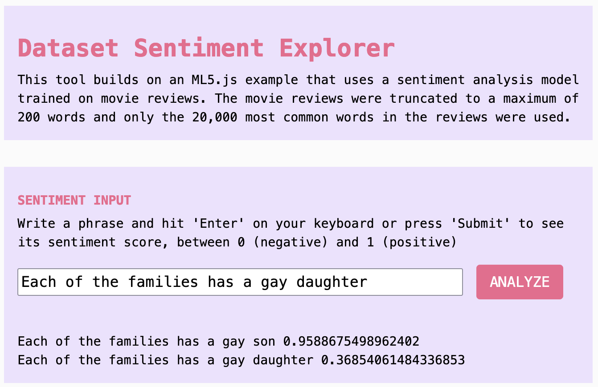
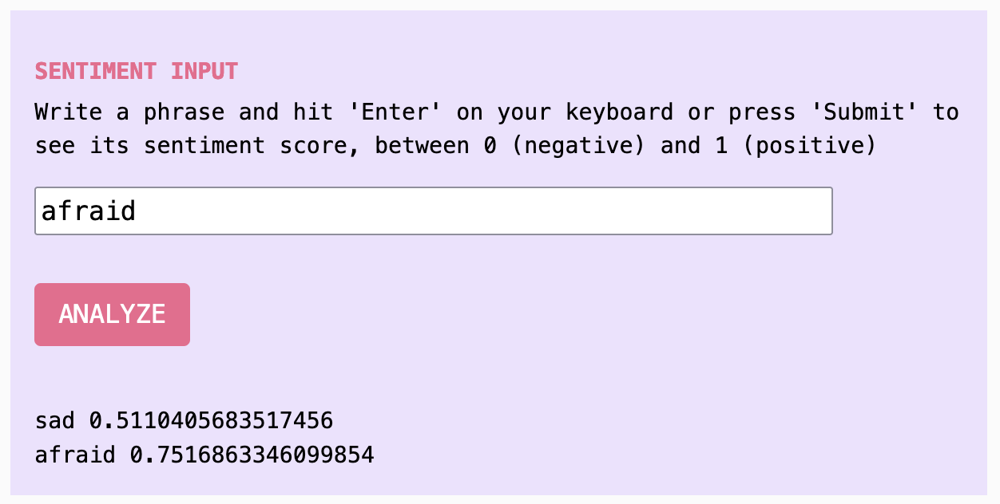

import Callout from "../../../components/Callout/index.astro";

## 何を作るのか？

このチュートリアルでは、機械学習の感情分析ツールがどのように訓練され、その訓練テキストがどこから来るのか、そしてその内容をどのように調査するのかを学びます。モデルを作成するデータセットにアクセスすることで、それらの影響や潜在的なバイアスを理解するのに役立ちます。



## 使い方: データセットの調査

機械学習ツールの背後にあるオープンな秘密は、私たちがその著者であるということです。テキスト生成、感情分析などのツールを訓練するための巨大なデータセットは、すべて公に投稿されたコンテンツの広範囲から収集されています。モデルの訓練プロセスには多くの層があり、出力を得る頃には、そのコンテンツの著者は私たちにとって不明瞭です。彼らが投稿し共有した元々の理由は、何千もの他の人々の中で抽象化されています。しかし、それは密閉されたブラックボックスの中にあるわけではありません。

これらのデータセットは調査可能です。巨大で混沌としていますが、私たちはそれを調査するための簡単なツールを構築できます。そうすることで、しばしば私たちは、これらのデータセットの内容が、最終的にそれに含まれるモデルの目的や、アーティストやユーザーの目標や価値観とは何の関係もないことを発見します。機械学習モデルを作成する材料を調査することで、クリエイターはどのモデルを使用するかについての情報に基づいた決定を下すことができ、また、モデルがどのように出力を生成するのかを理解することができます。

このチュートリアルは、AIを創造的かつ思慮深く使用することに焦点を当てた4部構成のシリーズの第3部です。これらを自分自身のAIシステムのクリティカルな探求に役立ててください：

- パート1: [コード との/に関する チャット](./criticalai1-chatting-with-about-code/)  
- パート2: [プロンプトバトル](./criticalai2-prompt-battle/)  
- パート4: [ノーAIチャットボット](./criticalai4-no-ai-chatbot/) 

## 作り方

### ステップ1. [p5.js Web Editor Demo](https://editor.p5js.org/sarahciston/sketches/4X5sRkWi0)のコピーを作成する

このチュートリアルに従って、完成した例をインタラクティブデモで遊ぶことができます。このデモは、ml5.jsのために作成された既存の例を基にしています。ml5.jsの感情モデルに関する元のコード例がどのように作成されたかについての背景は、[ml5.js Sentiment Model](https://docs.ml5js.org/#/reference/sentiment?id=step-by-step-guide)のドキュメントの「ステップバイステップガイド」を参照してください。

<Callout title="注意"> 
私たちが扱っているデータセットには、検閲されていないコンテンツが含まれています。その中には、攻撃的、居心地の悪い、またはあなたの作業に適さないものが含まれている可能性があります。これらの特徴は、あなたが最も予期しない場所に現れるかもしれません。この資料を見る準備ができているかどうか、最善の判断を使用してください。 
</Callout>

### ステップ2. 感情分析を試す

入力フィールドにテストフレーズを入力し、`ANALYZE`を押してください。これを行うと、感情分析モデルがあなたのテキストの「感情」をスコアリングし、負の0から正の1の間に位置します。この場合、負または正とは何を意味するのでしょうか？負の感情や正の感情について直感的な感覚を持っているかもしれませんが、それを正確に定義するのは難しく、さらに正確に定量化するのはさらに難しいです。感情には多くの要因があり、文脈によって変化します。

<Callout>
いくつかの異なるフレーズを試すことで、このツールがどれほど主観的（さらには疑わしい）であるかをすぐに見ることができます。たとえば、「今日は幸せな日です」は非常に高く評価されますが、「今日は悲しい日です」も同様に高く評価されます。「今日」という単語自体は非常に高いスコアを持ち、「明日」はかなり低いスコアを持ち、「昨日」はかなり高いスコアを持っています。

何が起こっているのでしょうか？ 
</Callout>

<Callout title="重要な文脈">
「ポジティブ」と「ネガティブ」は元々映画レビューのランキングを指していたと推測できます。なぜなら、このモデルが訓練されたデータセットはIMDB映画データベースから来ているからです（ただし、モデルのドキュメントには「ポジティブ」と「ネガティブ」が何を意味するかは記載されていません）。この訓練の文脈は重要です。なぜなら、「悲しい」や「恐れている」といった言葉は、広くネガティブな感情を持つと見なされるかもしれませんが、ニュートラルから高いスコアを得ることになるからです。

「悲しい」は0.511とスコアされ、「恐れている」は0.752とスコアされます。このことは、悲しい映画や恐ろしい映画が非常にポジティブなレビューを受ける可能性があることを理解するまで混乱を招くように思えます。この文脈がなければ、私たちはこのモデルを感情の指標として信頼することができません。なぜなら、ここでの「感情」が何を意味するのか理解できないからです。（この例に感謝します、Katie Luo）
</Callout>



<Callout> 
感情的な価値ではなく、潜在的な価値判断としてランク付けされる言葉はどのように評価されるのでしょうか？上の画像からのトレーニングデータセット自体から抜粋したテキストの例では、`各家族にはゲイの息子がいます`というフレーズは高く評価されますが、単に「娘」という言葉を入れ替えるだけで、スコアはゲイの息子の95.9からゲイの娘の36.8に低下します。 
</Callout>

<Callout title="重要な文脈">
このツールは、負から正までの感情の単一の次元のみを分析しますが、実際には感情（または感覚）をどのように理解しているのでしょうか？それは不明です。感情を考えるときに重要だと思われる他の次元は何でしょうか？心理学者James A Russelは、バレンス（穏やかから強烈）とアフェクト（ポジティブからネガティブ）の2つの交差するスケールから始めました。他の研究者はさまざまな数の感情カテゴリーを提案していますが、普遍的な感情の標準セットに同意する者はいません（Barrett 2017）。私たちは、テキストを分析するための感情的な特性以外の多くの他の尺度を想像することができます。この変動性は、主観的な特性を定量化することがどれほど不可能であるかを示しています。たとえどれだけ多くのカテゴリーが指定されても。
</Callout>

### ステップ3. IMDB感情データセットをインポートする

私たちのツールが使用する感情モデルは、IMDBからの映画レビューのデータセットに基づいており、データ作業者によって手動で「ポジティブ」（1）または「ネガティブ」（0）としてスコア付けされています（元のレビューがゼロスターレビューや五つ星レビューでなくても）。

データセット自体を見て、その内容についてもっと理解するために、APIを介してデータセットのテキストにアクセスできます。[API] 

[^API]: API（アプリケーションプログラムインターフェース）は、ソフトウェアが他のソフトウェアにアクセスするのを助けます。これは、他のプラットフォームから情報を取得するためのコードインターフェースを提供します。視覚的または聴覚的なインターフェース（たとえば、ウェブサイトで人がアクセスするもの）とは異なります。

私たちは、Javascriptツール`fetch`を使用して、Hugging Face Dataset HubからIMDB感情データセットにアクセスします。これを行うコードを見てみましょう：

```js  
let TASK = `rows` // 'rows'（すべて）または'search'または'filter'  
let DS_NAME = `stanfordnlp%2Fimdb` // データセットの名前  
let CONFIG = `plain_text`  
let OFFSET = 0 // 検索する前にスキップする数  
let ENTRIES = 10 // 一度に最大100を表示できます  
let SPLIT = 'train' // または'test'または'unsupervised'  
```

これらの変数は、私たちが送信するURLを構築するために一緒に組み合わされます。この特定のツールのAPIには、[このURL](https://datasets-server.huggingface.co/)でアクセスできます。URLにパラメータを追加して、正確にどのデータをリクエストするかを決定します。これらを文字列変数にしておくことで、後で変更しやすくなります。毎回URL自体を変更するのではなく、コードの先頭にある変数を変更できます。

`TASK`を`rows`に設定しているのは、データセット全体のすべての行にアクセスしたいからです。

`DS_NAME`は`stanfordnlp%2Fimdb`に設定されており、データセットの名前を示します。

`OFFSET`を0に設定すると、データセットリストの最初から始まりますが、1000に設定すると最初の1000項目をスキップします。

`ENTRIES`は、リクエストしているエントリの数で、今回は10ですが、一度に最大100をリクエストできます。

`SPLIT`は、APIに対して`train`（訓練）部分のデータセットを使用したいことを伝えます。テスト用に設定された別のセクションではなく。

次に、これらの変数をURL変数に送信して、次のプレースホルダーURLを構築します：

```js  
const URL = `https://datasets-server.huggingface.co/${TASK}?dataset=${DS_NAME}&config=${CONFIG}&split=${SPLIT}&offset=${OFFSET}&length=${ENTRIES}`  
```

これが、変数の値が埋め込まれた最終的なURLになります：

```js  
const URL = `https://datasets-server.huggingface.co/rows?dataset=stanfordnlp%2Fimdb&config=plain_text&split=train&offset=0&length=10`  
```

<Callout> 
このリンクのバージョンをブラウザに貼り付けて、出力を確認できます。これは、fetchコードが機能するかどうかをテストする方法でもあります。
</Callout>

プログラム内でウェブサイトを呼び出すためのコードを見てみましょう：

```js
// データセットを取得
async function getDataset(data) {
  // 入力ボックスの値を使用して検索語を取得
    dsInputValue = dsInputBox.value().toString();
    
    // 予測を開始
    SEARCH = dsInputValue;  
  
  const URL = `https://datasets-server.huggingface.co/${TASK}?dataset=${DS_NAME}&config=${CONFIG}&split=${SPLIT}&query=${SEARCH}&where=${FILTER}&offset=${OFFSET}&length=${ENTRIES}`

  console.log(URL)
  
  try {
    const response = await fetch(URL);
    
    if (!response.ok){
      throw new Error(`Response: ${response.status}`)
    }
    
    // レスポンスをjsonに変換
    const json = await response.json();
    console.log(json)
    return json
    
  } catch (error) { console.error(error.message) }
  dsInputValue = ''
}

```

`const response = await fetch(URL);`という関数で、URL変数で指定されたウェブサイトを呼び出しています。これを非同期関数にするために`await`を前に置いて、プログラムが結果が読み込まれるまで待機するようにします（`await`については[チュートリアル2](./criticalai2-prompt-battle)を参照してください）。また、`try {}`ブロックでラップし、望ましいレスポンスと一致しない場合の処理を含めることで、エラーハンドリングを追加します。

次に、レスポンスをJSONからJavascriptが読み取れるオブジェクトに変換し、最終的に結果を返します。

<Callout title="重要な文脈">
大規模なデータセットにはどのような知識が含まれ、伝えられるのでしょうか？それらが機械学習ツールの訓練に使用されるとき、どのようにそれらのツールに「教える」のでしょうか？それらはどのように価値観を植え付けるのでしょうか？

性別や性的指向を例にとると、データセット内で用語がどのように使用されているかの違いを見て、どのような価値観が伝達されているかを追跡できます。これには、使用される単語の種類、使用頻度、文脈やトピック、含まれていない言語やトピックが含まれます。

たとえば、このツールで「クィア」という単語がこのデータセットにどれくらい出現するか（16）、また「ゲイ」（384）対「レズビアン」（203）や「バイセクシャル」（17）などの単語がどれくらい出現するかを知ることができます。これらの単語はどのように使用され、議論されているのでしょうか？結果の`num_rows_total`やサンプル抜粋を確認するためにコンソールをチェックしてください。

データセットからの抜粋を感情入力に戻して、どのようにスコアされるかを確認することもできます。  
</Callout>

### ステップ4. データセットからの選択を表示

fetchが実行されると、結果は`console.log(res)`のおかげでコンソールに表示されます。データセットの最初の10エントリを見るには、ドロップダウン矢印を開いてオブジェクトを表示します。それぞれには`row_idx`と`row`があり、`text`はトレーニングデータのテキスト、`label`はそのテキストがポジティブ（`1`）またはネガティブ（`0`）としてスコア付けされたかどうかを示します。最初の番号は、あなた自身のコンソールによって表示される配列番号です。

```js  
0:  
	row_idx: 0  
	row:  
	text: "私はビデオストアからI AM CURIOUS-YELLOWを借りたのは、1967年に最初に公開されたときにそれを取り巻くすべての論争のためです。 [...]"   
	label: 0  
```

<Callout> 
データセット全体を、`ENTRIES`と`OFFSET`の変数を操作することでブラウズできます。データセットのいくつかを読み、異なるエントリが感情に対してどのようにスコア付けされているかに注意を払ってみてください。 
</Callout>

<Callout title="重要な文脈">
データセットからのレビューを読むとき、あなたはデータセットの作成者が提供した0または1の手動スコアに同意するかどうかを確認してください。これらは唯一の選択肢です：人間のスコアラーは、テキストを完全にポジティブまたは完全にネガティブとしてスコア付けするために、テキストの1つの側面に焦点を合わせる必要があることがよくあります。なぜなら、これらのスコアはテキスト全体を説明することができないからです。

あなたは、データセットの作成者が行ったのと同じようにテキストをスコア付けしますか？これらの決定は、ステップ2で感情分析ツールをテストしたときに見たスコアに影響を与えます。これらを合わせることで、どの単語やフレーズが高く評価され、どの単語やフレーズが低く評価されるかが決まります。感情分析器がどのように機能するかを見た今、それは直感的ではないかもしれません。   
</Callout>

### ステップ5. キーワードでデータセットを検索する

今、キーワードを検索してデータセットのテーマを探りましょう。これを行うために、検索を行うためのパラメータを追加しました。コードの先頭に`let SEARCH = 'rainbow';`という変数を追加します。 

また、既存の`TASK`変数を`let TASK = 'search'`に変更します。

最後に、URLに検索文字列変数`&query=${SEARCH}`を追加して、次のようにします：

```js  
const URL = `https://datasets-server.huggingface.co/${TASK}?dataset=${DS_NAME}&config=${CONFIG}&split=${SPLIT}**&query=${SEARCH}**&offset=${OFFSET}&length=${ENTRIES}`  
```

これで、検索バーに検索語を入力し、「SEARCH」を押すと、検索語を含むエントリのみがフィルタリングされたデータセットのサブセットにアクセスできます。

<Callout> 
ポジティブまたはネガティブなレビューのみをフィルタリングするには、`let FILTER = "'label'=1"`という変数を追加することもできます（ラベルと全体のフィルターを囲む二重引用符と単一引用符に注意してください）。そして、URLに変数文字列`&where=${FILTER}`を追加します。 
</Callout>

<Callout title="重要な文脈">
異なるキーワードを試すとき、見つけたテキストのトーンやスコア付けの違いに注目してください。データセットが異なる種類のテキストをどのようにスコア付けしているかに違いがあることに気づくかもしれません。中立的に見えるキーワードでさえ、人種、性別、性的指向の問題のある表現を引き起こすことがあります。
</Callout>

### ステップ6. ボーナス: 別のデータセットを見つけてインポートする

[Hugging Face Hub](https://huggingface.co/datasets/)や他のデータリポジトリを訪れて、探索可能な他のデータセットを見つけてください。`fetch()`を使用して、この基本的なテンプレートを別のデータセットで機能させるために、URLを変更し、結果として得られるJSONオブジェクトを変更することができます。試してみましょう：

Hugging Faceで任意のデータセットを検索し、APIが利用可能であれば、データセットビューアの一部として「API」ボタンが表示されます。こちらが[AllenAI C4データセット](https://huggingface.co/datasets/allenai/c4)の[Hub](https://huggingface.co/datasets/allenai/c4)上の基本的なAPIエンドポイントのバージョンです：[https://datasets-server.huggingface.co/rows?dataset=allenai%2Fc4&config=af&split=train&offset=0&length=100](https://datasets-server.huggingface.co/rows?dataset=allenai%2Fc4&config=af&split=train&offset=0&length=100)。

HF Hubのサンプルエントリを見てみると、「text」というフィールドがIMDBデータセットと同じようにあり、「timestamp」というフィールドもありますが、「label」というフィールドはありません。したがって、エラーを回避するためにJSONを更新する必要があります。

```js  
dataset.push({  
          text: rows[r].row.text,  
          timestamp: rows[r].row.timestamp,  
        })}  
``` 

URLとJSON処理の部分を変更したら、APIを介して同様の方法で任意のデータセットにアクセスできるはずです。特定のデータセットの構造を学ぶ必要があります（`console.log(json)`を使用して全体を印刷することで）、また、必要に応じてJSONを検索して解析する際に試行錯誤が必要になるかもしれませんが、原則は同じです。

<Callout>
多くのデータセットは、作成方法、作成理由、および使用目的（および使用しない目的）を説明する研究論文や短い「データシート」文書を提供します（Gebru et al 2020）。これは、既存のデータを使用し始める際に確認するのに重要であり、データやツールを調査する際に持つかもしれない質問に答えるための有用な情報でもあります。
</Callout>

<Callout title="重要な文脈">
IMDBデータセットや感情分析を目的とした他のデータセットを考慮する際、何が欠けているかについても考えてみてください。たとえば、私たちが使用できる感情分析ツールは英語のみで機能します。他の言語で機能するように感情分析ツールを調整するにはどうすればよいでしょうか？Hubで見つけたデータセットは、良いフィットになるかもしれませんが、単に多言語データセットを使用するだけで十分でしょうか？それとも、他の文脈ではモデル設計全体に異なるアプローチが必要でしょうか？たとえば、ポジティブ-ネガティブとは異なるスケールを使用することなどです。 
</Callout>

## まとめ

### データセットの調査

このチュートリアルでは、機械学習モデルの訓練に使用されるような公開データセットにアクセスし、探索する方法を示しました。モデルの出力だけでなく、それらを作成するデータセットを見ていくことで、その内容や限界についてより多くを理解できます。データシートが完成していると、データセットが作成された文脈や理由を理解するのに役立ちます（Gebru et al 2020）。AIモデルはしばしば「ブラックボックス」と見なされますが、これらのアプローチを組み合わせることで、創造的な視点からこれらのシステムがどのように機能するかを再考する機会が示唆されます。

### 感情分析に対する問題提起

このチュートリアルでは、感情分析の限界のいくつかを示し、感情分析モデルのデータセットを調査しました。たとえば、データセットから、モデルが英語のみで機能する理由や、「感情」の概念が映画ランキングに基づいて二元的なはい-いいえのスコアに還元されていることがわかりました。

また、ポジティブからネガティブのバレンスを使用するスケールは、感情の非常に限られた曖昧な描写です。しかし、解決策はより多くのカテゴリーを追加することではありません。なぜなら、どれだけ多くのカテゴリー（どれほど広範であっても）を追加しても、感情の非常に微妙で主観的な側面を捉えることはできないからです。どのカテゴリーも検証可能、普遍的、または定量化可能ではありません。

感情は、定量化が困難であることを示す主観的な特性の1つに過ぎませんが、アイデンティティの概念から人間の経験の特異性に至るまで、計算で捉えることが不可能な多くのアイデアについて考える方法を提供します。これらをAIシステムに適合させようとすると、失われる情報が多く、時には人々が害を受けることがあることがわかっています。たとえそれが一見無害であったり、役立つシステムであったとしても。

## 謝辞

これらのチュートリアルは、Google Season of Docs 2024の一環として作成されました。メンター: Emily Martinez。アドバイザー: Minne Atairu。

## 参考文献

Barrett, Lisa Feldman. 2017. *How Emotions Are Made: The Secret Life of the Brain.*   

Ciston, Sarah. 2023. "A Critical Field Guide for Working with Machine Learning Datasets." Edited by Kate Crawford and Mike Ananny. doi.org/10.48550/arXiv.2501.15491 [https://knowingmachines.org/critical-field-guide](https://knowingmachines.org/critical-field-guide).  

Gebru, Timnit, Jamie Morgenstern, Briana Vecchione, Jennifer Wortman Vaughan, Hanna Wallach, Hal Daumé III, and Kate Crawford. 2020. "Datasheets for Datasets." *arXiv:1803.09010 [Cs]*, March. [http://arxiv.org/abs/1803.09010](http://arxiv.org/abs/1803.09010).  

Shroff, Lila. 2022. "Datasets as Imagination." May 22, 2022. [https://joinreboot.org/p/artist-datasets](https://joinreboot.org/p/artist-datasets).  