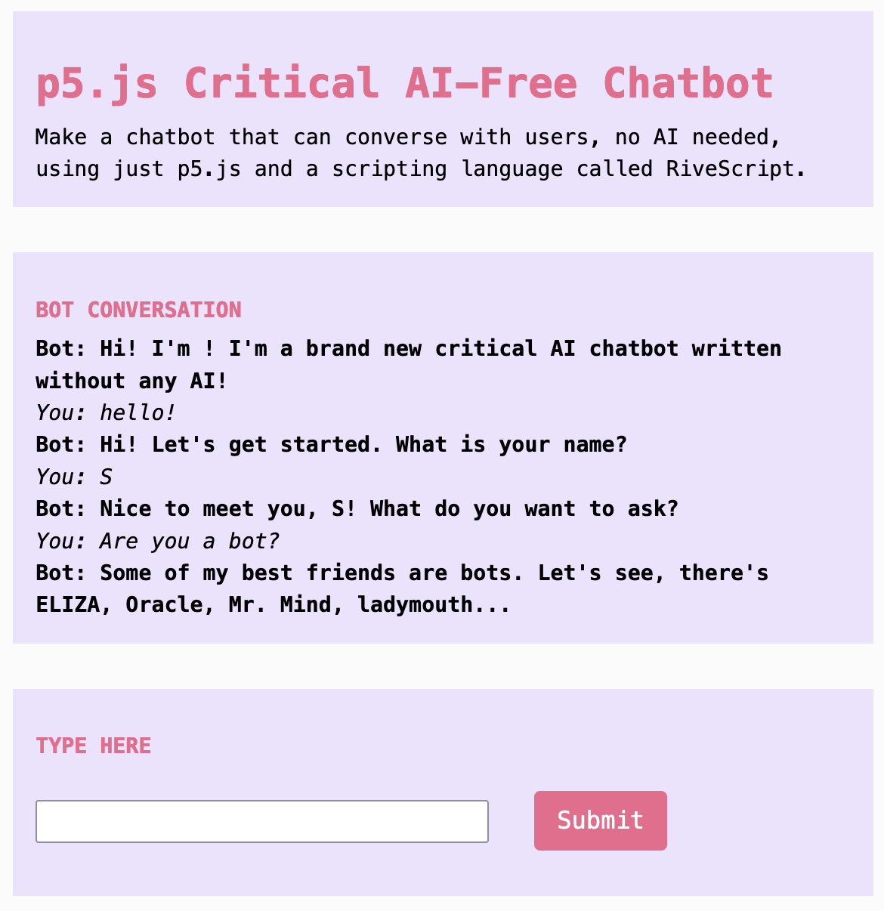

import Callout from "../../../components/Callout/index.astro";

## 何を作るのか?

このチュートリアルでは、AIを全く使用せずにインタラクティブなチャットボットをプログラムします。今日のボットが最先端の大規模言語モデルを使用しているのに、なぜAIをスキップするのでしょうか?ノーAIボットは、説得力のある人間と機械のインタラクションを作成するために必要なプログラミングがどれほど少ないかを示し、さらに最大のチャットボットシステムのいくつかの仕組みを示すのにも役立ちます。



## 使い方：カスタムチャットボット

現在の新しいチャットボットの爆発はあなたを代弁していますか?もし自分のボットがあったら、何を言わせたいですか?自分の声で話すボットを作りたいと思うかもしれません。それは、あなたが認識する声で、あなた自身のコミュニティに向けて話すことができるボットです。

チャットボットが訓練されるテキストデータとその訓練方法は、彼らが議論できるトピックとそれについての話し方を完全に決定します。カスタマイズされた大規模言語モデル（LLM）でさえ、最初にReddit、Wikipedia、Github、新聞、Smashwordsのようなファンフィクションサイトからスクレイピングされたデータをもとに作成された「基盤」モデルの上にファインチューニングされています。このような広範で無批判な収集は、平坦な音のボットの声を生み出し、多くのコミュニティを排除し、有害なバイアスを強化する可能性があります。

しかし、ボットは大規模AIのずっと前から多くの形で存在しており、あなたは自分のボットを作るのにAIは必要ありません。自分のツールを作成することは、プログラムされた交換を通じて「自然に見える」会話がどれほど構築されているかを考える機会です。なぜなら、あなたはこの交換の各部分をモデル化するためにコードを使用できるからです — 1960年代からボットプログラマーが行ってきたように。今や、LLMや新興のAIツールを使うことで、この作業の多くはプログラマーによって手動で行われるのではなく、統計によって行われます。しかし、これらは依然として、聴衆、文脈、メッセージ、目的（アリストテレスや多くの他のストーリーテリングの伝統でさかのぼる質問）を考慮する必要があります。

このチュートリアルは、AIを創造的かつ思慮深く使用することに焦点を当てた4部構成のシリーズの第2部です。これらを自分自身のAIシステムのクリティカルな探求に役立ててください:

- パート1: [コード との/に関する チャット](./criticalai1-chatting-with-about-code/)  
- パート2: [プロンプトバトル](./criticalai2-prompt-battle/)  
- パート3: [感情データセットエクスプローラー](./criticalai3-sentiment-dataset-explorer/)  

## それを作る方法

### ステップ1. インタラクティブなチュートリアル例で始める

このチュートリアルは、あなたがp5.jsと2000年代に作成されたRiveScript言語を使用して自分のチャットボットを作ることができるかどうかを試す挑戦です。ChatGPTのようなツールとは異なり、洗練されたAIモデル、大量の計算能力、または大量のトレーニングデータを必要としません。

<Callout title="重要な文脈">
機械学習なしで多くのことができます。ELIZAは、もっとも初期のチャットボットの1つで、1964年に作成されました。今日のAIチャットボットは、次にもっとも可能性の高い単語、文字、またはサブワード（トークンと呼ばれる）を予測することによってスクリプトを構築しますが、ELIZAのような古いチャットボットは手動でプログラムされたスクリプトを使用します — 私たちがp5.jsとRiveScriptを使用して実行する種類のものです。
</Callout>

チュートリアル例を[ p5.js Web Editor](https://editor.p5js.org/sarahciston/sketches/1OX3CcBOO)で開き、コピーを作成して始めてください。

<Callout>
このチュートリアルは、[Dan Shiffman's Coding Train](https://www.youtube.com/watch?v=wf8w1BJb9Xc)によるビデオチュートリアルに基づいており、RiveScript言語のより多くの機能を理解するために従うことができます。また、[RiveScriptのドキュメント](https://www.rivescript.com/docs/tutorial)も確認してください。
</Callout>

### ステップ2. 基本的なスクリプトファイルを理解する

`index.html`ファイルにRiveScriptライブラリを読み込むスクリプトタグが含まれていることを確認してください。それは、p5.jsライブラリを読み込むために使用するものと似ているはずですが、`rivescript.min.js`ファイルへのリンクがあります: 

`<script type="text/javascript" src="https://unpkg.com/rivescript@latest/dist/rivescript.min.js"></script>`

次に、拡張子が`.rive`のファイルが少なくとも1つあることを確認してください。私たちの場合、2つのファイルがあります: `dialogue.rive`ファイルは、ボットのための主要な会話部分を書く場所です。  
`sketch.js`ファイルで`.rive`ファイルにアクセスするには、まず変数`var bot = new RiveScript()`を宣言します。これにより、RiveScriptボットが作成されます。

次に、p5インスタンス内で、以下を含む`preload()`関数があることを確認してください:

```js
p5.preload = function(){
    bot.loadFile(["begin.rive", "dialogue.rive"])
        .then(botReady).catch(botError)  
    }  
```

この関数`bot.loadFile`は、ボットに作成したRiveScriptファイルへアクセスするように指示します。それから、私たちが作成する関数`botReady`を呼び出し、ボットの準備ができたことをコンソールに印刷します。エラーは、私たちが作成する関数`botError()`で処理します。

また、`Submit`ボタンが押されたときに実行される`botChat()`関数を作成します: 

```js  
function botChat(){  
      
    bot.sortReplies();  
    let username = "local-user"  
    let inputValue = userInput.value()  
    p5.createP((inputValue)).class('userConvo').parent(outputDiv)  
      
    let reply = bot.reply(username, inputValue).then(function(reply) {  
      console.log("ボットが言う: " + reply);  
      p5.createP(reply).class('botConvo').parent(outputDiv)  
    });

    userInput.value('') // 次のターンのために入力値をクリア  
  }  
```  

この関数では、ユーザーの入力を入力フィールドから取得し、それをRiveScriptボットに送信します。RiveScript関数は、私たちが書く対話ルールに基づいてユーザーの入力を処理し、その後、p5.jsを使用して段落要素に表示します。これに関する詳細は、[コーディングトレイン](https://www.youtube.com/watch?v=wf8w1BJb9Xc)を参照してください。

対話ファイルに戻って、会話を構築する方法を詳しく見てみましょう。

### ステップ3. ユーザー入力と応答を追加する

まず、チャットボットが何を議論するかを考えてみてください。ユーザーはボットに何を尋ねるでしょうか?彼らが必要な情報を得るために必要な質問の種類は何ですか?彼らが尋ねるかもしれない質問の短いリストを作成してください。

もし私たちのボットがチャットボットの歴史について教えているなら、ユーザーは次のような質問をするかもしれません:

`+ 最初のチャットボットは何ですか`

`+ 最初のチャットボットはいつ作成されましたか`

`+ 最初のチャットボットは誰が作りましたか`

`+`で始まる行は入力です。これらはすべて小文字で書かれ、句読点はありません。

ボットからの応答を書くには、各入力の下にハイフン（`-`）で始まる行を置きます。追加の行を追加でき、ボットはランダムに選択します。次の入力の前にスペースを空けてください。

```
+ 最初のチャットボットは何ですか
- 最初に知られているチャットボットはELIZAと呼ばれました。

+ 最初のチャットボットはいつ作成されましたか
- ELIZAは1964年に設計され、1966年にMITで紹介されました。

+ 最初のチャットボットは誰が作りましたか
- コンピュータ科学者ジョセフ・ワイゼンバウムが実験として1964年にボットELIZAを作りました。
```

<Callout title="重要な文脈">
汎用チャットボットの前に、ほとんどのボットは特定の目的と特定のペルソナを持つように設計されていました。ボットのトーンを選択する際には、トピックと目的に合ったものを選んでください。ボットの人格は、その目的に基づいてどのように変わりますか?それは言語の選択を通じてどのように表現されますか?
</Callout>

### ステップ4. 入力の選択肢でバリエーションを追加する

ELIZAのもっとも有名なスクリプトはDOCTORで、セラピストを模倣していました（しかし、数学や詩を教えるものも含まれていました）。DOCTORは、オープンエンドの質問をたくさんするためにそのセラピストのペルソナを使用したため、とても説得力がありました。それは（擬似）ランダム性、プレースホルダー、およびワイルドカードを使用して、機械が人間のように応答しているかのような感覚を生み出しました。そのスクリプトは、ユーザーの入力から借用して、個別の応答を作成しました。技術は変わりましたが、これらのテクニックは、今日のユーザーがチャットボットとつながるための戦略とあまり変わりません。

RiveScriptの機能を使用して、ユーザーの質問をプレースホルダーやワイルドカードで処理できます。ユーザーは、あなたが提案した正確な質問を常にするわけではありません。彼らは時々、これらのトピックに関するバリエーションを尋ねるでしょう。選択肢の構造を使用して、ユーザーの入力を更新しましょう。これは、括弧とパイプを含みます: 

```
+ 最初のチャットボットは（最初のチャットボット|それ）ですか
- ELIZAは1964年に設計され、1966年にMITで紹介されました。

+ （最初のチャットボット|それ）を作ったのは誰ですか
- コンピュータ科学者ジョセフ・ワイゼンバウムが実験として1964年にボットELIZAを作りました。
```

括弧は複数の選択肢のセットを指定し、パイプ文字は各選択肢を区切ります。入力`who made (the first chatbot|it)`では、ユーザーは`who made the first chatbot`または`who made it`のいずれかを入力でき、どちらの入力もその答えを引き起こします。以下は、テーマを共有するいくつかの質問をグループ化するためのより複雑な例です: 

```
+ （機械は考えられるか|ボットは賢いか|あなたはチャットGPTと同じくらい良いか|コンピュータと人間は似ているか?）
- あなたは私と話しているのではありませんか?
```

これらのいずれかの入力は、同じ応答を受け取ります。

### ステップ5. 複数の応答でさらなるバリエーションを追加する

ユーザーが言う可能性のあるフレーズごとに、応答の追加例を追加できます。これにより、ボットは同じトピックに関する応答の選択肢を提供することで、よりダイナミックに見えます。ハイフンで始まる追加の行は、同じユーザー入力のバリエーションに対してすべての潜在的な応答です: 

```
+ （機械は考えられるか|ボットは賢いか|あなたはチャットGPTと同じくらい良いか|コンピュータと人間は似ているか?）
- それを尋ねるのはボットだけです! {weight=3}
- 私はそうは思いません。しかし、私はそう思ったので...それは逆説です。
- "私はボットです。すべてのボットは嘘つきです。" -ミスター・マインド（ボット）
```

思考機械の質問とその回答をグループ化することで、応答はランダムに選択され、質問のすべてのバリエーションに適用されます。

また、各回答がどのくらいの頻度で与えられるかを調整できます。`{weight=X}`を追加し、Xを各回答の数値にします: 

```
- それを尋ねるのはボットだけです! {weight=3}
- 私はそうは思いません。しかし、私はそう思ったので...それは逆説です。{weight=1}
- 私は答えられる質問にしか応答しません。{weight=1}
- "私はボットです。すべてのボットは嘘つきです。" -ミスター・マインド（ボット）{weight=2}
```

重みが指定されていない場合、応答はランダムに選択されます。

<Callout title="重要な文脈">
重みを追加することで、ボットの応答に明示的にバイアスを追加しています。なぜなら、それは特定の方法で他の方法よりも頻繁に答えるからです。バイアスは計算システムの一部で常に存在します。それらは、ソートと分類に基づいてコンピュータシステムの設計が行われているため、すべての暗黙のバイアスを考慮できません。インタラクティブツール[OpinionGPT](https://opiniongpt.informatik.hu-berlin.de/)では、研究者たちが特定のコミュニティによって書かれたテキストのみを使用してGPTモデルを訓練し、いくつかのタイプのバイアスを強調することを目指しました。彼らは、既存のバイアスの例をより明白に示し、すべての計算システム内の潜在的な問題を示すことを望んでいました。彼らのモデルを操作する際、ボットの「ペルソナ」やトレーニングモデルによって使用される言語の違いを聞くことができますか?あなた自身のチャットボットのために言語を選択する際、どのトーンや言葉の選択を使用してそのペルソナとメッセージを伝えますか?
</Callout>

### ステップ6. ワイルドカード、キーワード、および保存された変数を使用する

ボットがユーザーに特有の応答をするように見せるために、ユーザーの言語を応答にコピーできます。

<Callout title="重要な文脈">
これは、ELIZAタイプのボットを非常に魅力的にした戦略の一部でした。ELIZAは、特定のテンプレートをトリガーするキーワードを使用しました。これにより、ユーザーの入力をトピックに適した応答へ変換し、入力テキストを再利用しました。「私はあなたが好きではないと思う」という入力は、「あなたが私を好きではないと思う理由は何ですか?」に変わる可能性があります。これは、「私」を「あなた」に置き換えるような単純な置換によって行われます。今日のチャットボットを使用しているとき、彼らが期待する言語を繰り返すのに気づきますか?これは、彼らが（置換ではなく）前のものに続くもっとも可能性の高い文字、単語、またはフラグメントを予測することによって機能するからです。
</Callout>

アスタリスク（`*`）をワイルドカード文字として使用して、オープンエンドの入力と対話できます。ブラケット内にアスタリスクを置くと、それはオプションになります。単語の両側に置くと、そのキーワードが出現するたびにルールが適用されます: 

```
+ [*] ボット [*]
- 私はボットです。あなたもボットですか?  
- それを尋ねるのはボットだけです! 
```

この例は、`ボット`という単語の前後に任意のテキストを許可することを示しています。

ユーザーが入力したフレーズを保存し、応答でそれを参照するには、応答内で`<star>`を使用します。たとえば、ボットは次のように応答できます: `私のお気に入りの<star>はあなたのお気に入りです。` 

ワイルドカードが複数ある場合、ボットは`<star1>`と`<star2>`を使用できます。

それはまた、後続のワイルドカードのためのワイルドカードを含みます。応答として、ボットは次のように応答できます: `あなたはなぜ<star1> <star2>を知っていますか?` そして、`<star1>`はユーザーからのオプションの入力を埋め、`<star2>`はユーザーからのワイルドカード入力を埋めます。

### ステップ7. ボーナス：会話パターン

<Callout>
コードの会話パターンを適用する方法を決定するために、通常の非デジタルチャットでこれらの同じテクニックをどのように使用するかを考えてみてください。それぞれが会話をどのように形作るか?また、どう創造的に使用するか?それらの意図された機能に制限しないでください! 
</Callout>

ここに、試してみたいRivescriptの追加機能があります。これはあくまで概要です。ボットの構文に関する詳細を理解するには、[RiveScriptチュートリアル](https://www.rivescript.com/docs/tutorial)を読んでください。

これらのオプションのキーワード、配列、変数などの概念が、似たようなプログラミング概念にどのように関連しているかに注意してください。なぜなら、多くのチャットボットはルールベースのシステムであり、設計者によって設定されたルールの流れに従うように書かれているからです。彼らは、最新のチャットボットとは異なり、統計的に作成されたルールを持っています（しかし、依然としてプログラマーによって設計されています）。

**変数を設定**して情報を保存します。これはp5.jsで行うのと同じです。ボットが最初にあなたの名前を尋ねたとき、これは次のように変数として保存されました:

```
+ 私の名前は*
- <set name=<star>>お会いできて嬉しいです<name>! 
```

このやり取りは、ワイルドカードの情報を`<name>`という変数として保存し、後でそれを取得するために使用できます。

**条件文を使用**して、`name`の値が設定されているかどうかをテストします。これはif文のように機能します（行の先頭にアスタリスクが示されます）。`name`が未定義である場合、つまり値が設定されていない場合、その行の応答が与えられます。そうでなければ、`name`に値が設定されている場合、その条件行と次の行の応答は無視されます。

```
+ 私の名前は何ですか
* <get name> == undefined => あなたはそれを教えてくれませんでした。
- あなたの名前は<get name>です。
```

**宣言文を宣言し、置換します。** 行の先頭に感嘆符（`!`）を置くことで、`begin.rive`ファイルに読み込むプリセットなどの情報を事前に宣言できます。すべての`.rive`ファイルはバージョンで始まり、これを感嘆符で設定します: 

`! version = 2.0`  

これを使用して、ボットがメモリに保存するプリセットを定義できます: 

```
! var name = あなたのボット
! var age = 5
```

変数は後で呼び出すこともできます。次のように応答に入れます: `"こんにちは、私の名前は<bot name>です。私は<bot age>歳です。"`

置換は同じ方法で宣言されます。例の置換リストは、チュートリアルの`begin.rive`ファイルに提供されており、たとえば次のようになります: 

```
! sub i'm = 私は
! sub don't = しません
! sub what's = 何ですか
```

**リダイレクト**は、アットマークを使用してユーザー入力を異なる応答グループに送信します: 

```
+ [*] バナナ [*]
@ [*] ボット [*]
```

この例では、ユーザーがキーワードバナナを入力すると（前後に任意の単語があっても）、ボットは`ボット`の応答グループにリダイレクトされます。

置換とリダイレクトは、ユーザーの発言にバリエーションがあっても会話が流れるようにするための便利なツールです。これにより、一般的なフレーズのバリエーションに対してすべてのユーザー入力の重複バージョンを書く必要がなくなります。

**以前の/一緒に遊ぶ**は、何かが1ターン以上前で言われた場合にボットが特定の方法で振る舞うことを許可します。パーセント（`%`）記号を使用して、以前のやり取りからの行を参照します。これにより、ボットはより長い思考の列を続けることができます。これは、ボットについてのボットや、あなたのボットが議論するトピックにおいてどのように役立つでしょうか?

<Callout>
ボットをAPIに接続してみてください。ボットにどのようなインタラクションを持たせたいですか?どのような質問に答えるべきですか?よりダイナミックなインタラクションのために、`fetch`やAPIアクセスを追加することを検討できます（[チュートリアル3:  感情データセットエクスプローラー](./criticalai3-sentiment-dataset-explorer)で説明されています）。たとえば、ユーザーの代わりにGoogle検索できます。

AIを使用しないボットがGoogle検索をすることは、ChatGPTのような大規模言語モデルを使用するよりもはるかに少ない自然資源を使用し、プログラムするのもはるかに簡単です! 
</Callout>

## まとめ

AIツールが提示される方法と比較して、ルールベースのボットは最初古風に見えるかもしれませんが、もっとも複雑なツールでさえ期待に応えないことがあります。彼らは壊れやすく、プラットフォームや設計した企業によって確立された制約に制限されています。自分のチャットボットの対話を書くことで、会話の流れだけでなく、視覚インターフェースやインタラクションの方法も制御できます。

自分のボットを作成することは、AIシステムやその他のシステムがユーザーの入力をどのように解釈するかを理解するのにも貢献します。私たちが現在使用しているAIシステムの多くは、複雑な人間とコンピュータのシステムであり、その中のごく一部だけが機械学習タスクを必要とします。自分のボットでは、人工的な会話を自然に感じさせるために必要なプログラミングがどれほど少なかったかを考えてみてください。これらの多くの機能は、1964年にジョセフ・ワイゼンバウムによって作成された最初のチャットボットに存在していました。そして、人工知能は1950年にアラン・チューリングによって早くも想像されていました。現在のボットの爆発は新しい流行ではなく、人間とコンピュータの相互作用の長い系譜の一部です。

<Callout title="重要な文脈">
どのツールを選ぶかを決定する際、すべてのプロジェクトにおいてAIは必要ですか?どのケースで必要で、どのケースでp5.jsを使用してAIツールをカスタマイズし、どのケースでオプトアウトしますか?
</Callout>

## 謝辞

これらのチュートリアルは、Google Season of Docs 2024の一環として作成されました。メンター: Emily Martinez アドバイザー: Minne Atairu

## 参考文献

Barry D, Ciston S, *et al*. *Please Go On: ELIZA's Enduring Legacy.* MIT Press. In Press.

Haller, Patrick, Ansar Aynetdinov, and Alan Akbik. 2024. "OpinionGPT: Modelling Explicit Biases in Instruction-Tuned LLMs." In *Proceedings of the 2024 Conference of the North American Chapter of the Association for Computational Linguistics: Human Language Technologies (Volume 3: System Demonstrations)*, 
edited by Kai-Wei Chang, Annie Lee, and Nazneen Rajani, 78-86. Mexico City, Mexico: Association for Computational Linguistics. [https://doi.org/10.18653/v1/2024.naacl-demo.8](https://doi.org/10.18653/v1/2024.naacl-demo.8).

Shiffman, Daniel. The Coding Train, dir. 2017. 10.2: Chatbots with RiveScript - Programming with Text. [https://www.youtube.com/watch?v=wf8w1BJb9Xc](https://www.youtube.com/watch?v=wf8w1BJb9Xc).  
