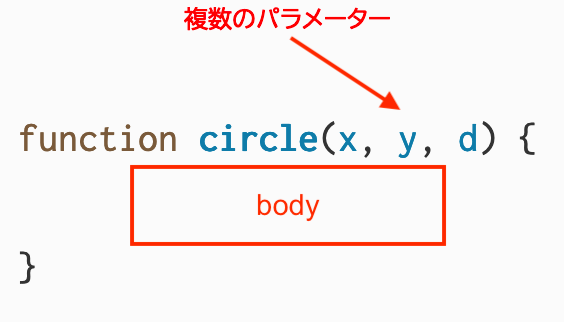

import Callout from "../../../components/Callout/index.astro";

このチュートリアルでは、前回のチュートリアル [条件分岐とインタラクティビティ](/tutorials/conditionals-and-interactivity) の[日の出アニメーション](https://editor.p5js.org/gbenedis@gmail.com/sketches/9lz2aqfTO)を基に、カスタム関数を使用してコードを整理したバージョンを作成します。このチュートリアルの最後に作成するスケッチの[例](https://editor.p5js.org/gbenedis@gmail.com/sketches/lamalgcPZ)はこちらです。


関数について学び、それらを使ってコードを整理し改善する方法を学びます。以下の基本的なプログラミングの概念について学びます：

- p5.jsライブラリに組み込まれた関数
- カスタム関数を作成し、それらを使ってコードを簡単に整理し再利用する方法
- 引数、パラメータ、戻り値

## 前提条件

- [環境のセットアップ方法](/tutorials/setting-up-your-environment)
- [はじめよう チュートリアル](/tutorials/get-started)
- [変数と変更 チュートリアル](/tutorials/variables-and-change)
- [条件分岐とインタラクティビティ チュートリアル](/tutorials/conditionals-and-interactivity)
- [デバッグのフィールドガイド](/tutorials/field-guide-to-debugging)

始める前に、以下のことができるようになっているはずです：

- キャンバス上に図形やテキストを追加しカスタマイズする
- `mouseX`、`mouseY`、`mouseIsPressed`を使用して簡単なインタラクティビティを追加する
- カスタム変数を宣言、初期化、使用、更新する
- p5.jsプロジェクトに線形およびランダムな動きを組み込む
- 条件文を使用してプログラムの流れを制御する
- コードにコメントを付け、エラーメッセージに対処する

コードの整理は、より複雑で面白いプログラムを作成する上で重要なスキルです。他の人がコードを理解しやすくし、コラボレーションを容易にします。また、自分のコードを理解し、アイデアを拡張するのにも役立ち、デバッグにも役立ちます。関数は、コードをより整理され、再利用可能で、アクセスしやすくするための強力な方法です。

## 関数とは何か？

*関数*は、特定の関数名に割り当てられた、定義されたタスクを完了するコードのブロックです。ほとんどのp5.jsスケッチには、すでに少なくとも2つの*関数宣言*、`setup()`と`draw()`が含まれています。*関数宣言*は、関数を使用する前に定義するために使用されます。以下はp5.jsでの関数宣言の構文です：


キーワード`function`は、関数が宣言されていることをp5.jsに知らせます。関数の名前は、それがどのように呼び出されるかを定義します。この例では、関数の名前は`setup`です。関数の名前の後には括弧のペア`()`が続きます。関数の**本体**は、中括弧`{}`内のコードのブロックで、関数が呼び出されたときに実行されます。p5.jsでは、`setup()`は再生ボタンが押されたときに自動的に実行される特別な組み込み関数です。

```js
// スケッチの最初にsetup()関数を定義します。
// これは描画用のキャンバスを作成します！
function setup() {
  createCanvas(400, 400);
}
```

関数が使用されるとき、私たちはプログラム内で関数が**呼び出された**と言います。`setup()`関数は、スケッチが開始されたときに*呼び出され*ます。つまり、`setup()`の本体内のコードブロックがプログラムの開始時に一度実行されます。同様に、`draw()`はp5.jsライブラリに組み込まれた別の関数で、すべてのスケッチで宣言されます。`draw()`が呼び出されると、その本体内のコードブロックが繰り返し実行されます。プログラムが停止するまで何度も実行されます。

[`draw()`](/reference/p5/draw)と[`setup()`](/reference/p5/setup)のp5.jsリファレンスページを訪れて、詳細を学んでください。

## カスタム関数の定義

コードをグループ化する独自の関数を作成することもできます。前回のチュートリアル、[条件分岐とインタラクティビティ](/tutorials/conditionals-and-interactivity)では、[日没アニメーション](https://editor.p5js.org/gbenedis@gmail.com/sketches/9lz2aqfTO)を作成しました。そこでは`draw()`内のコードに、空、太陽、山々のセクションがコメントで示されていました。関連するコードをグループ化し、特定の名前を付けたカスタム関数を宣言することができます。


### ステップ1：コメントで関数を計画する

- 日没アニメーションを複製するか、[この例](https://editor.p5js.org/gbenedis@gmail.com/sketches/9lz2aqfTO)を複製し、"Organized Sunset Animation"と名付けてください。
- カスタム関数を定義する前に、[日没アニメーション](https://editor.p5js.org/gbenedis@gmail.com/sketches/9lz2aqfTO)のコードをどのように再編成するかの概要から始めましょう：

  `````js
  function setup() {
    createCanvas(600, 400);
  }
  
  function draw() {
    // 空のための関数;
    // 太陽のための関数;
    // 山々のための関数;

    // 変数を更新するための関数
  }
  `````

上記のコメントで説明されている4つの異なる関連コードのグループがあることがわかります：空を描くコード、太陽を描くコード、山々を描くコード、そして変数を更新するコードです。

これで、元のスケッチと同じコードを含む、上記のコメントで説明された4つの異なるカスタム関数を作成できます。カスタム関数は通常、`setup()`と`draw()`の外部、コードの一番下で定義されます。

[`function`](/reference/p5/function)のp5.jsリファレンスページを訪れて、詳細を学んでください。


### ステップ2：空のためのカスタム関数を作成し呼び出す

- `sky()`という名前の関数を定義します。この関数はスケッチの空の色をレンダリングします。

  `````js
  // 空を描くための関数
  function sky() {
    background(redVal, greenVal, 0);
  }
  `````

- スケッチで`sky()`を使用するには、`draw()`内で以下の構文で**関数呼び出し**を行います：

  `````js
  function draw() {
    // sky関数を呼び出す
    sky();

    // 太陽のための関数;
    // 山々のための関数;
  
    // 変数を更新するための関数
  }
  `````

あなたのコードは以下のようになるはずです：

```js
//色の変更のための変数
let redVal = 0;
let greenVal = 0;

//太陽の位置のための変数
let sunHeight = 600; //地平線より下の点

function setup() {
  createCanvas(600, 400);
  noStroke(); //図形の輪郭を削除
}

function draw() {
  // sky関数を呼び出す
  sky();
  
  // 太陽のための関数;
  // 山々のための関数;
  // 変数を更新するための関数
}

// 空を描くための関数
function sky() {
  background(redVal, greenVal, 0);
}
```

`sky()`を呼び出すと、`draw()`が実行されるたびに`sky()`の本体内のコードが実行され、変化する空の色がキャンバスに追加されます。**関数呼び出し**には、関数名の後に括弧`()`が続きます。

### ステップ3：太陽のためのカスタム関数を作成し呼び出す

太陽を描くコードを関数に移動し、drawで関数を呼び出します。

- `sky()`関数を定義した後に、`sun()`という関数を宣言し、太陽を描くコードを中括弧内に含めます。
  - `function sky()`の終わりの後に以下のコードを追加します：

    `````js
    //太陽を描くための関数
    function sun() {
      // 太陽を描く。
      fill(255, 135, 5, 60);
      circle(300, sunHeight, 180);
      fill(255, 100, 0, 100);
      circle(300, sunHeight, 140);
    }  
    `````

- `draw()`内の太陽を描くコードの行を、この*関数呼び出し*に置き換えます：

  `````js
  // sun関数を呼び出す
  sun();
  `````

あなたのコードは以下のようになるはずです：

```js
//色の変更のための変数
let redVal = 0;
let greenVal = 0;

//太陽の位置のための変数
let sunHeight = 600; //地平線より下の点

function setup() {
  createCanvas(600, 400);
  noStroke(); //図形の輪郭を削除
}

function draw() {
  // sky関数を呼び出す
  sky();
  
  // sun関数を呼び出す
  sun();
  
  // 山々のための関数;
  // 変数を更新するための関数
}

// 空を描くための関数
function sky() {
  background(redVal, greenVal, 0);
}

// 太陽を描くための関数
function sun() {
  fill(255, 135, 5, 60);
  circle(300, sunHeight, 180);
  fill(255, 100, 0, 100);
  circle(300, sunHeight, 140);
}
```

このステップでは、円を使って太陽を描く`sun()`という新しい関数を宣言しました。`draw()`関数は`sun()`を呼び出し、それが`fill()`と`circle()`を呼び出します。`fill()`と`circle()`もまた、p5.jsライブラリに組み込まれた関数であり、プログラマーが宣言する必要はありません。

あなたが宣言するカスタム関数は、シンプルな構成要素から形、色、アニメーションを作成します。これがコンピューティングの力です：シンプルな基礎の上に複雑なスケッチを構築します。p5.jsの多くの組み込み関数を使用してアニメーションやインタラクティブなアートを作成してきました。今や、独自の関数を作成し、p5.jsライブラリの力を拡張する能力があります。独自の関数を定義することで、多くのものを作成できます！

利用可能なすべての組み込み関数について詳しく学ぶには、[リファレンスページ](https://p5js.org/reference/)を訪れてください。括弧`()`が続くすべての項目が関数です！

### ステップ4：山々のためのカスタム関数を作成し呼び出す

山々を描くコードを関数に移動します：

- `mountains()`という関数を宣言し、山々を描くコードを中括弧内に含めます。
  - `function sun()`の後に以下の行をスケッチに追加します：

    `````js
    //山々を描くための関数
    function mountains() {
      fill(110, 50, 18);
      triangle(200,400,520,253,800,400);
      fill(150, 75, 0);
      triangle(-100, 400, 150, 200, 400, 400);
      fill(150, 100, 0);
      triangle(200, 400, 450, 250, 800, 400);
      fill(100,50,12);
      triangle(-100,400,150,200,0,400);
      fill(120,80,50);
      triangle(200,400,450,250,300,400);
    }
    `````

- `draw()`から山々を描くコードの行を削除し、mountains()関数呼び出しに置き換えます：

  `````js
  // mountains関数を呼び出す
  mountains();
  `````

あなたのコードは以下のようになるはずです：

```js
//色の変更のための変数
let redVal = 0;
let greenVal = 0;

//太陽の位置のための変数
let sunHeight = 600; //地平線より下の点

function setup() {
  createCanvas(600, 400);
  noStroke(); //図形の輪郭を削除
}

function draw() {
  // sky関数を呼び出す
  sky();
  
  // sun関数を呼び出す
  sun();
  
  // mountains関数を呼び出す
  mountains();
}

// 空を描くための関数
function sky() {
  background(redVal, greenVal, 0);
}

// 太陽を描くための関数
function sun() {
  fill(255, 135, 5, 60);
  circle(300, sunHeight, 180);
  fill(255, 100, 0, 100);
  circle(300, sunHeight, 140);
}

// 山々を描くための関数
function mountains() {
  fill(110, 50, 18);
  triangle(200,400,520,253,800,400);
  fill(150, 75, 0);
  triangle(-100, 400, 150, 200, 400, 400);
  fill(150, 100, 0);
  triangle(200, 400, 450, 250, 800, 400);
  fill(100,50,12);
  triangle(-100,400,150,200,0,400);
  fill(120,80,50);
  triangle(200,400,450,250,300,400);
}
```

`mountains()`関数は`fill()`と`triangle()`関数を呼び出して山々を作成し、`x, y`と`size`の引数を渡してカスタマイズします。関数がコードを整理し、読みやすくするのに役立つことに注目してください！

<Callout>

- 風景に他のオブジェクトを描くための新しい関数を定義してください。
- 変数を更新する新しい関数を定義してください。

[こちらが例です。](https://editor.p5js.org/Msqcoding/sketches/i2rLEvKct)

</Callout>

## パラメータを使って関数をカスタマイズする

あなたの`sky()`、`sun()`、`mountains()`関数は全て、関数宣言と関数呼び出しの際に空の括弧を持っています。`print()`や`circle()`のような他の関数は、呼び出す際に括弧の中に値を入れる必要があります。関数が**呼び出される**ときに括弧内に置かれる値は**引数**として知られています。**引数**は何らかの方法で関数をカスタマイズします。


上のコードスニペットでは、`print()`関数が呼び出されるときに引数が渡されています。引数は文字列`'hello'`です。`print()`関数は括弧内に置かれた値をコンソールに表示します。`print`の関数宣言は次のようなものだと想像できます：


**関数宣言**では、括弧内にリストされた変数を**パラメータ**と呼びます。パラメータは、関数呼び出しの引数の値によって置き換えられるプレースホルダーとして機能します。

上記の例では、`print('hello')`は関数呼び出しであり、その関数宣言の本体にあるコードを実行します。値`'hello'`は引数として関数呼び出しに渡されます。この引数は、関数宣言内の`message`パラメータを置き換えます。コードブロックが実行され、`message`のすべてのインスタンスが`'hello'`に置き換えられ、`'hello'`がコンソールに表示されます。


`circle()`の関数呼び出しには3つの引数が必要です - x座標用、y座標用、円の直径(`d`)用です。

p5.jsライブラリ内の関数宣言は、このようなものだと想像できます：



`circle()`の関数宣言には、括弧内にコンマで区切られた3つのパラメータがあります：`x`、`y`、`d`です。引数は特定のパラメータに割り当てられます。この場合、`x`には300が、`y`には`sunHeight`の現在の値が、`d`には180が割り当てられます。関数の本体には、キャンバス上に円を作成するコードが含まれており、円の位置を決定するために`x`と`y`を、直径には`d`を使用します。

独自の関数を定義する際、関数宣言の括弧内にパラメータを配置できます。これにより、関数呼び出し時に引数を使用してカスタマイズすることができます。関数呼び出しに渡す引数の数が、その宣言内のパラメータの数と一致することを確認してください！キャンバス上に`butterfly()`関数の複数回の呼び出しを使って描かれた[蝶の例](https://editor.p5js.org/Msqcoding/sketches/SgRfbWeWN)を探索してみてください。

1つ以上のパラメータを必要とする関数は、正常に実行するために宣言内のパラメータの数と一致する正しい数の引数が必要です。関数が十分な引数を受け取らない場合、不足している引数には`undefined`という値が割り当てられ、これがエラーを引き起こし、奇妙な結果を生み出す可能性があります。関数呼び出しで不正確な数の引数を使用した場合に受け取る可能性のあるエラーの例については、[デバッグのフィールドガイド](/tutorials/field-guide-to-debugging)の例2と例7を参照してください。

日の出アニメーションに木を追加することで、これがどのように機能するかを見てみましょう。


### ステップ5：パラメータを持つカスタム関数を追加する

まず、空の括弧を持つ`tree()`関数を定義します。長方形と三角形を使って簡単な木を描くことができます。

- `draw()`の外側にスケッチに`tree()`関数宣言を追加します：

  ```js
  //木を描画する関数
  function tree() {
    // 木を描画する。
    fill(80,30,20);
    rect(200,320,20,60);
    fill(20,130,5);
    triangle(180,320,210,240,240,320)
  }
  ```

- 風景や山の後に`draw()`内に`tree()`の関数呼び出しを含めます：

  ```js
  // tree関数を呼び出す
  tree(); 
  ```


関数を使って単一の木を描くことで、コードの構成が改善されます。この関数の真の力は、異なる位置とサイズで複数の木を簡単に描けるようにすることです。`tree()`関数宣言にパラメータを追加することで、それをカスタマイズし、異なる引数を使って複数回呼び出すことができます。

この関数をクッキーの型抜きのように考えると役立ちます。例えば、上で作成したものと似ているが、関数を呼び出すたびに異なる位置とサイズを持つ新しい木を作ることができます。これを実現するには、各木をカスタマイズできるように関数宣言にパラメータを含める必要があります。

- `tree()`の関数宣言を書き直して、3つの引数：`x`、`y`、`size`を含めます。これらの引数は、`rect()`と`triangle()`関数内でプレースホルダーとして使用されます。

  ```js
  //異なるx、y、サイズで木を描画する関数
  function tree(x,y,size) {
    // 木を描画する。
    fill(80,30,20);
    rect(x-size,y,size*2,size*6);
    fill(20,130,5);
    triangle(x-size*3,y,x,y-size*8,x+size*3,y)
  }
  ```

- `draw()` 関数内で引数を使って2つの木を描画します。

  ```js
    // 2つの木を描画する
  tree(150, 320, 10)
  tree(210, 320, 10)
  ```

あなたのコードは以下のようになるはずです：

```js
//色変更のための変数
let redVal = 0;
let greenVal = 15;

//太陽の位置のための変数
let sunHeight = 600;

function setup() {
  createCanvas(600, 400);
  noStroke(); //形状の輪郭を削除
}

function draw() {
  // sky関数を呼び出す
  sky();

  // sun関数を呼び出す
  sun();

  // mountains関数を呼び出す
  mountains();

  // 2つの木を描画する
  tree(150, 320, 10)
  tree(210, 320, 10)
}

// 空を描画する関数
function sky() {
  background(redVal, greenVal, 0);
}

// 太陽を描画する関数
function sun() {
  fill(255, 135, 5, 60);
  circle(300, sunHeight, 180);
  fill(255, 100, 0, 100);
  circle(300, sunHeight, 140);
}

//山を描画する関数
function mountains() {
  fill(110, 50, 18);
  triangle(200,400,520,253,800,400);
  fill(150, 75, 0);
  triangle(-100, 400, 150, 200, 400, 400);
  fill(150, 100, 0);
  triangle(200, 400, 450, 250, 800, 400);
  fill(100,50,12);
  triangle(-100,400,150,200,0,400);
  fill(120,80,50);
  triangle(200,400,450,250,300,400);
}

//異なるx、y、サイズで木を描画する関数
function tree(x,y,size) {
  fill(80,30,20);
  rect(x-size,y,size*2,size*6);
  fill(20,130,5);
  triangle(x-size*3,y,x,y-size*8,x+size*3,y)
}
```

各木をカスタマイズするパラメータは `x`、`y`、および `size` です。これらのパラメータはそれぞれ木のx座標、y座標、サイズを指定します。木の相対的な形状を維持するために、`rect()` と `triangle()` 関数はパラメータと[算術演算子](https://developer.mozilla.org/en-US/docs/Web/JavaScript/Reference/Operators#arithmetic_operators)を使用した**数値式**を使用します。`x - size` のような**数値式**は、数値結果をもたらす数学的計算です。関数呼び出しの引数として数字と[算術演算子](https://developer.mozilla.org/en-US/docs/Web/JavaScript/Reference/Operators#arithmetic_operators)が使用される場合、その結果が引数として渡されます。

例えば、`draw()` で呼び出される `tree(210, 320, 10)` の関数呼び出しを追跡、または*トレース*して、引数が `rect()` 関数にどのように渡されるかを見てみましょう：

`tree(210, 320, 10)` が `draw()` で呼び出され、ここで `x = 210`、`y = 320`、`size = 10` となります

- `rect()` 関数呼び出しで使用される数式は以下の通りです：

  ```js
  rect(x-size,y,size*2,size*6); 
  ```

- `x = 210`、`y = 320`、`size = 10` の場合、以下の値が代入されます：

  ```js
  rect(210-10,320,10*2,10*6);
  ```

- 結果として得られる引数がキャンバス上に図形を描画するために使用されます：

  ```js
  rect(200,320,20,60); 
  ```

同様に：

- `triangle()` 関数呼び出しで使用される数式は以下の通りです：

  ```js
  triangle(x-size*3, y, x, y-size*8, x+size*3,y) 
  ```

- `x = 210`、`y = 320`、`size = 10` の場合、以下の値が代入されます：

  ```js
  triangle(210-10*3, 320, 210, 210 + 10*3, 320);
  ```

- 結果として得られる引数がキャンバス上に図形を描画するために使用されます：

  ```js
  triangle(180, 320, 240, 320); 
  ```

引数が変更されると、木は修正され、異なる位置や異なるサイズで描画されることがあります。

- [この例](https://editor.p5js.org/Msqcoding/sketches/u0VkgENt4)を探索して、特定の引数の変更がキャンバス上に描画される木をどのようにカスタマイズするかを確認してください。

`rect()` と `triangle()` 関数の正確な数式は、試行錯誤を通じて見つけることができます。静的な木から始めて、木に加えたい変更のための式を作成することは、素晴らしい出発点です！塗りつぶしや線の色を変更するパラメータを追加することさえ試すことができます。

- [この例](https://editor.p5js.org/Msqcoding/sketches/yqFWzi_5X)を探索して、数値式を使用してxとyのパラメータを追加する方法のステップバイステップの指示を確認し、`mouseX` と `mouseY` を使用して関数をテストしてください。

パラメータを含むカスタム関数のより多くの例については、[`function`](/reference/p5/function)のp5.jsリファレンスページをご覧ください。

同じ `tree()` 関数を使用して2つの木を作成することで、スケッチ内のコードの量を減らすことができます。これにより、コードが短くなり、読みやすくなります。コードが少なくなると、デバッグも容易になります。

<Callout>

- 間違った数の引数で `tree()` を呼び出してみてください。何が起こりますか？
- 既存の関数の1つを修正して、パラメータを使用するようにしてください。
- パラメータを使用して風景内の異なるオブジェクトを描画する別の関数を宣言してください - 例えば、`seagull(x, y, size)` や `cloud(x, y, size)` などです。

こちらは[例](https://editor.p5js.org/Msqcoding/sketches/l4Mq4a4HG)です。

</Callout>

## 戻り値

`random()` のような関数は、コードの他の場所で使用できる値を生成、つまり**戻す**ことができます。以下は、パラメータに5を加えてその結果を返す関数の例です：


他の関数宣言と同様に、キーワード `function` の後に関数名と括弧のペアが続きます。この関数には1つのパラメータ `n` が括弧内にあります。関数の本体には数値式と**return文**が含まれています。キーワード `return` は、関数にコードブロックの実行を終了し、結果を出力値として提供するよう指示します。

[例](https://editor.p5js.org/mcintyre/sketches/BvgR93OHj)を使って、`plus5()` が返す値をテキストとして表示してみましょう。新しいp5.jsプロジェクトを開き、以下のコードを `script.js` ファイルに追加してください：

```js
function setup() {
  createCanvas(400, 400);
}

function draw() {
  background(220);
  
  // plus5()を呼び出して計算を行います。
  let number = plus5(10);
  
  // テキストのスタイルを設定します。
  textAlign(CENTER);
  textSize(30);
  
  // テキストを表示します。
  text(10 + 5 = ${number}, width / 2, height / 2);
}

function plus5(n) {
  let ans = n + 5;
  return ans;
}
```

このスケッチでは、変数 `number` を定義し、`plus5(10)` 関数呼び出しが返す値を割り当てました。引数10は関数宣言内のパラメータ `n` に置き換わります。`plus5()` の最初の行で、10+5 つまり15の結果が変数 `ans` に格納されます。その後、関数は15の値を返します。最後に、[文字列補間](https://developer.mozilla.org/en-US/docs/Web/JavaScript/Reference/Template_literals#string_interpolation)を使用して `number` を `text()` 関数に渡し、答えを表示しました。

こちらは `plus5()` を使用して流れ星の軌跡を描く[別の例](https://editor.p5js.org/mcintyre/sketches/sWNY9_UO_)です：

```js
function setup() {
  createCanvas(400, 400);
}

function draw() {
  // 透明度を持つ黒い空を描画します。
  background(0, 50);
  
  // ストロークを設定します。
  stroke(255);
  strokeWeight(5);
  
  // フレームごとにx座標を増加させます。
  let x = frameCount;
  
  // plus5()を呼び出してy座標を計算します。
  let y = plus5(x);
  
  // 流れ星を描画します。
  point(x, y);
}

function plus5(n) {
  let ans = n + 5;
  return ans;
}
```

`draw()` 内で、`frameCount` の値を変数 `x` に格納し、それを `plus5()` に渡しました。また、`plus5(x)` が返す値を変数 `y` に格納しました。最後に、`x` と `y` を `point()` 関数呼び出しの引数として使用し、左から右に移動する流れ星を表示しました。スケッチが実行されるにつれて、x と y（draw関数内）の両方に格納される値が増加します。流れ星が対角線に沿って移動することに注目してください。

詳しくは、[return](/reference/p5/return)のp5.jsリファレンスページをご覧ください。

### ステップ6: カスタム関数を他のカスタム関数内で使用する

この考え方を練習するために、日の出アニメーションのスケッチに戻り、`plus5()`によく似た`treeLine()`という関数を定義しましょう。これはパラメータを使ってもう少し計算を行い、結果を返します：

```js
// 直線に沿った木のy座標を計算する関数。
function treeLine(x) {
  let y = -0.7 x + 450;
  return y;
}
```

`let y = -0.7 * x + 450;`という文は、パラメータ`x`に`-0.7`を掛け、その値に`450`を加え、その値を変数`y`に格納し、`y`を返します。

- `treeline()`関数と、いくつかの木を描く`trees()`関数を宣言します。スケッチに`treeLine()`関数の宣言を追加してください：
  - `draw()`の下に以下の行を追加してください：

    ```js
    function treeLine(x) {
      let y = -0.7 * x + 450;
      return y;
    }
    ```

- スケッチに`trees()`関数の宣言を追加します。
  - `draw()`の下に以下の行を追加してください：

    ```js
    function trees() {
      // 1本目の木
      let x = 150;
      let y = treeLine(x);
      tree(x, y, 5);
     
      // 2本目の木
      x = 180;
      y = treeLine(x);
      tree(x, y, 5);
     
      // 3本目の木
      x = 210;
      y = treeLine(x);
      tree(x, y, 5);
    }
    ```

- `draw()`内に`trees()`関数の呼び出しを追加します。
  - `draw()`内に以下の行を追加してください：

    ```js
    // trees()関数を呼び出す
    trees();
    ```
あなたのコードは以下のようになるはずです：

```js
//色の変更のための変数
let redVal = 0;
let greenVal = 15;

//太陽の位置のための変数
let sunHeight = 600;

function setup() {
  createCanvas(600, 400);
  noStroke(); //図形の輪郭を削除
}

function draw() {
  // sky関数を呼び出す
  sky();
  
  // sun関数を呼び出す
  sun();
  
  // mountains関数を呼び出す
  mountains();
  
  // 2本の木を描く
  trees()
}

// 空を描く関数
function sky() {
  background(redVal, greenVal, 0);
}

// 太陽を描く関数
function sun() {
  fill(255, 135, 5, 60);
  circle(300, sunHeight, 180);
  fill(255, 100, 0, 100);
  circle(300, sunHeight, 140);
}

//山を描く関数
function mountains() {
  fill(110, 50, 18);
  triangle(200,400,520,253,800,400);
  fill(150, 75, 0);
  triangle(-100, 400, 150, 200, 400, 400);
  fill(150, 100, 0);
  triangle(200, 400, 450, 250, 800, 400);
  fill(100,50,12);
  triangle(-100,400,150,200,0,400);
  fill(120,80,50);
  triangle(200,400,450,250,300,400);
}

//異なるx、y、サイズで木を描く関数
function tree(x,y,size) {
  fill(80,30,20);
  rect(x-size,y,size2,size6);
  fill(20,130,5);
  triangle(x-size3,y,x,y-size8,x+size3,y)
}

//木を描くための線を作成する関数
function treeLine(x) {
  let y = -0.7 x + 450;
  return y;
}

//treeLine()とtree()関数を使用して
//多くの木を描く関数
function trees() {
  // 1本目の木
  let x = 150;
  let y = treeLine(x);
  tree(x, y, 5);
  
  // 2本目の木
  x = 180;
  y = treeLine(x);
  tree(x, y, 5);
  
  // 3本目の木
  x = 210;
  y = treeLine(x);
  tree(x, y, 5);
}
```

上記のステップで、あなたは`treeLine()`という関数を定義しました。これは複数の木を描くことができる線を計算します。また、以前に作成した`tree()`関数と`treeLine()`関数を使用して、風景の中に複数の木を線に沿って描く関数も定義しました。

[あなたのプロジェクトがどのように見えるかの例はこちらです！](https://editor.p5js.org/gbenedis@gmail.com/sketches/lamalgcPZ)

<Callout>
- `treeLine()`内の式`let y = -0.7 * x + 450;`を、`-0.7`と`450`以外の値を使用するように修正してください。
- 一度に1つの数字を変更し、結果を観察してください。
</Callout>

## `keyPressed()` 関数

`setup()`や`draw()`のような関数に加えて、プログラムにインタラクティビティを追加する他のp5.jsの組み込み関数を使用することができます。`keyPressed()`関数はプログラムで定義すると便利な関数で、ユーザーがキーを押したときにトリガーされます。


### ステップ7: アニメーションにインタラクティビティを追加する

スケッチの一番下に`keyPressed()`関数を定義してください。

```js
function keyPressed() {
  redVal=0;
  greenVal = 0;
  sunHeight = 600;
}
```


`keyPressed()`は、キーボードの任意のキーが押されたときに1回実行されます。ここでは、キーが押されたときに変数を初期位置にリセットするために使用しています。これにより、基本的にアニメーションを最初から開始します。

[サンプルスケッチへのリンク](https://editor.p5js.org/gbenedis@gmail.com/sketches/lamalgcPZ)

`keyPressed()`は、ユーザーが押した`key`変数にもアクセスでき、より多くのユーザーインタラクティビティを可能にします。同様に、スケッチ内に`mousePressed()`関数を定義することもでき、これはユーザーがマウスをクリックするたびに1回実行されます。

以下は探索できるいくつかの例です：

- [`keyPressed()`](https://editor.p5js.org/Msqcoding/sketches/QEqQlTWpU)
- [`keyPressed()` と `key`](https://editor.p5js.org/Msqcoding/sketches/HkDcaRKk4)
- [`mousePressed()`](https://editor.p5js.org/Msqcoding/sketches/bz6vz74tJ)

[`keyPressed()`](/reference/p5/keyPressed)や[`mousePressed()`](/reference/p5/mousePressed)のような関数の詳細については、[p5.jsリファレンスのイベントセクション](/reference#Events)をご覧ください。

## まとめ

`tree()`のような関数を使うと、複雑なアイデア（木を描く）をより単純なアイデア（[2D形状](/reference#Shape)を描く）の組み合わせで表現できます。`trees()`関数は、この考えをさらに発展させて木の列を作ります。風景をスケッチするにせよ、インタラクティブな光のショーをデザインするにせよ、関数は複雑なアイデアをより単純なものから構築するのに役立ちます。これを**抽象化**と呼びます。抽象化によって、細部に気を取られることなく、より高いレベルに集中できます。魔法の森をアニメーション化するために、`triangle()`と`rect()`を何百回も呼び出すコードを想像してみてください。すべてを把握するのは難しいでしょう。関数を使えば、形状の具体的な座標などの詳細を、エレガントで整理された方法で扱う抽象化を作成できます。スケッチがより複雑になるにつれて、適切な抽象化を作成することで、全体像に集中しやすくなることに気づくでしょう。

<Callout>
ランダムな位置に表示されたり、周りを飛び回ったりする蝶`🦋`絵文字を表示する`butterfly()`関数を宣言してください。`draw()`内で`butterfly()`関数を呼び出して表示します。

こちらが[例](https://editor.p5js.org/gbenedis@gmail.com/sketches/yGn00cD2Q)です。

##### またはこのスパイシーなチャレンジに挑戦してみてください！

全く新しいスケッチを作成し、異なる風景をアニメーション化してください。関数を使用してこのエキサイティングなプロジェクトを計画し、整理してください。
</Callout>

## 次のステップ

- [ループによる繰り返し](/tutorials/repeating-with-loops) 


## リファレンス

- [式と演算子](https://developer.mozilla.org/en-US/docs/Web/JavaScript/Reference/Operators#arithmetic_operators)
- [文字列補間](https://developer.mozilla.org/en-US/docs/Web/JavaScript/Reference/Template_literals#string_interpolation)
