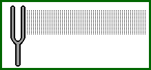
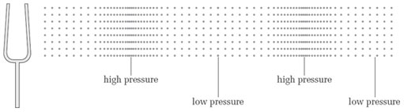
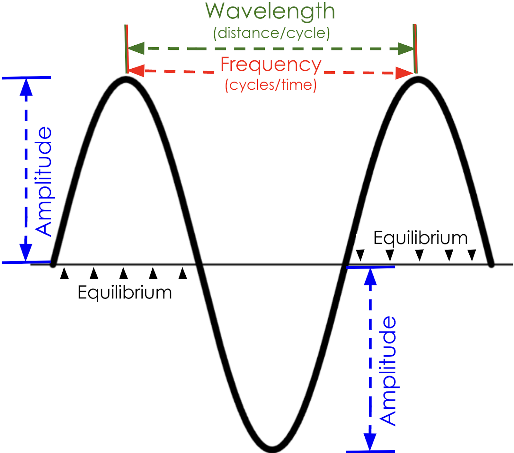

import Callout from "../../../components/Callout/index.astro";

## はじめに

[音楽](https://www.britannica.com/art/music)は、世界中の文化で声楽や器楽の[音](https://www.britannica.com/science/sound-physics)を組み合わせて、その歴史、感情、経験を伝えるために使用されています。音楽の基本要素の1つは[*メロディー*](https://www.masterclass.com/articles/music-101-what-is-melody)です。これは、聴いて心地よい音の構成を形成する音符のグループです。このチュートリアルでは、[`p5.Oscillator`](/reference/p5.sound/p5.Oscillator/)オブジェクトを使用して音符を生成し、ユーザーがメロディーを作成して再生できるWebアプリを開発する方法を学びます! 

このチュートリアルは、メロディーアプリの異なるバージョンを作成する3部構成のシリーズの第1部です。

- パート1: このチュートリアルでは、ユーザーが音階からメロディーを作曲し、再生できる[シンプルなメロディーアプリ](https://editor.p5js.org/Msqcoding/sketches/w_4t5bFYe)を開発します。
- パート2: [Node.jsを始めよう](/tutorials/getting-started-with-nodejs)では、[Node.js](https://nodejs.org/en/about)と[Express.js](https://expressjs.com/)を使用して、コンピュータに保存されたメロディーを取得して再生する[HTTP](https://developer.mozilla.org/en-US/docs/Web/HTTP)リクエストをルーティングする方法を学びます。
- パート3: Node.jsを使用したメロディーアプリ(近日公開!)では、[シンプルなメロディーアプリ](https://editor.p5js.org/Msqcoding/sketches/w_4t5bFYe)を[Node.js](https://nodejs.org/en/about)と[Express.js](https://expressjs.com/)と統合する方法を学びます。ユーザーがメロディーをコンピュータに保存し、後で再生のために取得できるより複雑なメロディーアプリを開発します。


## 前提条件

このチュートリアルには以下が必要です: 

- インターネット接続とスピーカーまたはヘッドフォンを備えたコンピュータ
- [p5 Webエディタ](https://editor.p5js.org/)（またはIDEと最新の[p5.jsライブラリをダウンロード](https://p5js.org/download/)）
- [p5.js入門チュートリアル](/tutorials/#introduction)で学んだ基本的なプログラミングの概念の理解:
  - 変数
  - ファイルの読み込み
  - 条件分岐
  - 配列
  - forループ
  - JSONオブジェクト
- [Webデザインチュートリアル](/tutorials/#web-design)で紹介された基本的なWebデザインの原則の理解
  - [p5.js DOMオブジェクト](/reference/#DOM)

**注意:** セクション1.1〜1.5では、物理学や音楽理論などの他の分野の概念を紹介しています。これらのセクションは、p5.Oscillatorオブジェクトがどのようにメロディーを作成できるかを理解するための背景知識のリソースです。[シンプルなメロディーアプリ](https://editor.p5js.org/Msqcoding/sketches/w_4t5bFYe)を完成させるために必須ではありませんが、これらのセクションを確認することを強く推奨します。

以下の内容にすでに精通している場合:

- [`p5.Oscillator`オブジェクト](#p5-oscillator-objects)
- [音波](#sound-waves)
- [圧力波](#pressure-waves)
- [周期波とその特性](#periodic-wave-characteristics)
- [音符（周波数、ピッチ、振幅）](#musical-notes)

背景知識をスキップして[オシレーターで音符を演奏する](https://docs.google.com/document/d/1mzJv-7qU1_CmkWI0ZFeqf3CeBfpOOVIrvPRZtxqFxRI/edit#heading=h.xqocsbtmp68w)に進んでください。

## オシレーター、科学と音楽の背景情報

### p5.Oscillatorオブジェクト<a id="p5-oscillator-objects"></a>

[`p5.Oscillator`](/reference/p5.sound/p5.Oscillator/)オブジェクトは、[音符](https://www.simplifyingtheory.com/music-note/)を演奏できる[オシレーター](https://www.techtarget.com/whatis/definition/oscillator)と呼ばれる電気信号を生成するための情報を保持します。これらの信号は、特定の速度で繰り返すパターンで最小値と最大値の間を変化します。この信号がスピーカーを通して再生されると、音として聞こえます! 

オシレーターがどのように音符を生成するかを理解するために、[音](https://www.britannica.com/science/sound-physics)の背後にある科学について掘り下げてみましょう。


##### 注意

次のセクション[音と音楽の科学](https://docs.google.com/document/d/1mzJv-7qU1_CmkWI0ZFeqf3CeBfpOOVIrvPRZtxqFxRI/edit#bookmark=id.xmj3wil8257x)では、以下の概念が紹介されます: 

- [圧力波としての音](https://www.physicsclassroom.com/class/sound/u11l1c.cfm)
- [周期波の特性](https://docs.google.com/document/d/1mzJv-7qU1_CmkWI0ZFeqf3CeBfpOOVIrvPRZtxqFxRI/edit#heading=h.p80snea79dfs)
- 音符に関連する[音波](https://www.open.edu/openlearn/science-maths-technology/engineering-technology/sound-music-technology-an-introduction/content-section-2.3)
  - [ピッチと周波数](https://www.physicsclassroom.com/class/sound/Lesson-2/Pitch-and-Frequency)
- [メロディー](https://www.masterclass.com/articles/music-101-what-is-melody)、[音符と周波数](https://www.idrumtune.com/ultimate-guide-to-musical-frequencies/)などの音楽理論の概念

##### スキップする

上記の背景概念にすでに精通している場合は、[メロディーアプリを作る](https://docs.google.com/document/d/1mzJv-7qU1_CmkWI0ZFeqf3CeBfpOOVIrvPRZtxqFxRI/edit#heading=h.xqocsbtmp68w)セクションにジャンプしてプロジェクトを始めましょう! 

## 音と音楽の科学

[メロディー](https://www.masterclass.com/articles/music-101-what-is-melody)は、聴いて心地よい[音](https://www.britannica.com/science/sound-physics)を形成する[音符](https://www.simplifyingtheory.com/music-note/)の集まりです。[音](https://www.britannica.com/science/sound-physics)は**圧力波**として説明され、**オシレーター**によって生成できます。

### 1.1 - 音と圧力波<a id="sound-waves"></a>

宇宙空間で音が聞こえるかどうか、または水中で音が低くなる理由を考えたことはありますか?

物理科学では、音は空気やその他の[物質](https://letstalkscience.ca/educational-resources/backgrounders/introduction-particle-theory-matter)の[分子と粒子](https://letstalkscience.ca/educational-resources/backgrounders/introduction-particle-theory-matter)の振動によって作られるエネルギーです。音をひとつの場所から別の場所へ運ぶ物質を**媒質**と呼び、液体（水など）、気体（空気など）、固体（壁やドアなど）があります。これらの振動する物質の粒子は**圧力波**を作り出し、媒質を通じて音をひとつの場所から別の場所へ運びます。

**圧力波**は、媒質内の粒子が近づき合って高圧領域を作り出すときに、エネルギーを運ぶ任意の乱れのことです。音叉が音を作り出す様子を示す以下のgifを考えてみましょう:



[*出典：The Physics Classroom: Sound Waves and Music - Lesson 1 - The Nature of a Sound Wave*](https://www.physicsclassroom.com/class/sound/u11l1c.cfm)

上のgifでは、音叉が周囲の[物質の粒子](https://letstalkscience.ca/educational-resources/backgrounders/introduction-particle-theory-matter)を振動させ、音のエネルギーを運ぶ圧力波を作り出しているのが分かります。その圧力波が耳に届くと、粒子の振動を音として聞くことができます! 宇宙空間で音が聞こえない理由は、音のエネルギーを運ぶ媒質がないからです! 

音がどのように物質を通って伝わるかをよりよく理解するために、[このビデオ](https://www.youtube.com/watch?v=px3oVGXr4mo)で拍手の音によって形成される圧力波のデモンストレーションをご覧ください! 

圧力波と音の背後にある科学についてもっと学ぶには、以下のリソースをご覧ください：[物質の粒子理論](https://letstalkscience.ca/educational-resources/backgrounders/introduction-particle-theory-matter)、[圧力波としての音](https://www.physicsclassroom.com/class/sound/u11l1c.cfm)、[波と鼓膜](https://www.physicsclassroom.com/mmedia/waves/edl.cfm)。

### 1.2 - 周期波と音<a id="pressure-waves"></a>

圧力波は、媒質内の圧縮された粒子の繰り返しパターンとして説明できます。**圧縮**は、粒子が密集している高圧領域によって特徴付けられます。**希薄**は、粒子がより広がっている低圧領域によって特徴付けられます。以下の画像は、音叉によって生成された音波による空気の高圧領域と低圧領域を示しています。空気粒子が密集している領域は高気圧に、空気粒子が離れている領域は低気圧に対応していることに注目してください。



[*出典：Sound for Music Technology - The Open University*](https://www.open.edu/openlearn/science-maths-technology/engineering-technology/sound-music-technology-an-introduction/content-section-2.3)

音を作り出す圧力波は、単に媒質内の圧縮と希薄の繰り返しサイクルの連続です。波の1サイクル、1つの**振動**には、高圧領域（圧縮）と低圧領域（希薄）が含まれます。一定の時間間隔で繰り返される振動は、私たちが音符やその他の音として聞く**周期波**を形成します! 

例えば、スピーカーは電気回路によって生成された周期的なパターンで表面を上下に動かすことで音波を生成します。以下のgifは、スピーカーによって生成された音波が空気粒子を通って伝わる様子を示しています: 

 

[*出典：Flipping Physics*](https://www.flippingphysics.com/uploads/2/1/1/0/21103672/0327-animated-gif-6_2.gif)

左側の黒い線はスピーカーの表面を表し、黒い点の列は空気粒子を表しています。

スピーカーは、その表面を周期的なパターンで右から左に動かすことで音を生成します。スピーカーの表面が右に動くと、空気粒子を右に押し、それらが近づき合う（圧縮する）原因となります。粒子が圧縮すると、高気圧領域が作られ、媒質を通じて音のエネルギーが伝達されます。

上のgifでは、赤い線が空気中で粒子が圧縮され音のエネルギーを伝達する領域を示しています。[周期的な正弦曲線](https://www.investopedia.com/terms/s/sinewave.asp#:~:text=A%20sine%20wave%20is%20a,oscillates%20above%20and%20below%20zero.)の形をした青い線は、音が空気を通って伝わる際の圧力変化を示しています。空気粒子が圧縮される領域は青い線の最高点（高圧）と一致します。粒子がより広がっている領域は青い線の最低点（低圧）と一致します。

媒質内の粒子が音のエネルギーを運ぶために前後に振動するものの、実際には移動しないことに気づきましたか?赤い線は、媒質の粒子からのエネルギー伝達によって音のエネルギーがどのように運ばれるかを示しています。音が粒子の振動と同じ方向に伝わることに注目してください。これは、音が**縦波**であることを意味します! [縦波](https://www.physicsclassroom.com/class/waves/Lesson-1/Categories-of-Waves)についてもっと学ぶにはこのリソースをご覧ください。

音波は一般的に、媒質を通って音が伝わる際の圧力変化を表す[周期的な正弦曲線](https://www.investopedia.com/terms/s/sinewave.asp#:~:text=A%20sine%20wave%20is%20a,oscillates%20above%20and%20below%20zero.)を使って図示されます（上のgifの青い線のように）。

#### 周期波の特性<a id="periodic-wave-characteristics"></a>

周期波は、以下の図に示される特性を使って説明されます: 



ラベルの説明:

- **平衡位置**：振動の*静止位置*を表し、波の中央に水平な直線として表されることが多いです。
  - 圧力波の場合、平衡位置は音がないときの媒質内の圧力を表します。
- **波長**：波の2つの同一点間の距離、または1つの振動の長さ。
  - 音波の波長は、連続する2つの圧縮間、または連続する2つの希薄間の距離です。
- **振幅**：平衡線と波の最高点または最低点との間の距離
  - 音波の場合、振幅は音の強さ、つまり音量を表します。
* **周波数**：特定の時間内に発生する振動の数。
  - 周波数は多くの場合**ヘルツ（Hz）**で測定され、1秒あたりのサイクル数を測定します。**1 Hz = サイクル/秒**
  - 圧力波の周波数は、**Hz**で測定され、1秒間に1点を通過する圧縮または希薄の回数です。


### 1.3 - 音符と波の特性<a id="musical-notes"></a>

[音符](https://www.simplifyingtheory.com/music-note/)は周期的な圧力波によって運ばれる[音](https://www.britannica.com/science/sound-physics)なので、波の特性を使って説明できます。

音波の**振幅**は、音の強さを表す尺度で、音量として聞くことができます。高い音量で演奏される[音符](https://www.simplifyingtheory.com/music-note/)は振幅が大きく、低い音量で演奏される音符は振幅が小さくなります。振幅と音楽についてもっと学ぶには、[このリソースをご覧ください](https://www.howmusicworks.org/103/Sound-and-Music/Amplitude-and-Frequency)。

音波の**平衡位置**は、音が伝わっていないときに媒質内の粒子によって伝達されるエネルギーを表します。平衡位置では、音の音量は0で、媒質内の圧力はある静止値にあると考えることができます。

音波の**周波数**は、高音から低音までの音の高さ、つまりピッチとして聞くことができます。[音符](https://www.simplifyingtheory.com/music-note/)は、特定の周波数で短時間演奏される音波です。低い周波数で演奏される音符は、ベースギターで演奏される音符のような低い音に対応します。高い周波数で演奏される音符は、フルートで演奏される音符のような高い音に対応します。音符が特定の波の周波数にどのように対応するかについてもっと学ぶには、[このリソースをご覧ください](https://www.idrumtune.com/ultimate-guide-to-musical-frequencies/)。

p5.Oscillatorオブジェクトと波の簡単な紹介については、[The Coding TrainのSound Synthesisチュートリアル](https://www.youtube.com/watch?app=desktop\&v=Bk8rLzzSink)をご覧ください。

## オシレーターで音符を演奏する

それでは、音、音楽、オシレーターの素晴らしい世界に飛び込んで、[シンプルなメロディーアプリ](https://editor.p5js.org/Msqcoding/sketches/w_4t5bFYe)を作成しましょう! 


### ステップ1 – 音符を演奏できるp5.oscillatorオブジェクトを作成する

新しいp5.jsプロジェクトを開き、"Play a note"という名前を付けて保存します。

- `index.html`ファイルに[p5.js soundライブラリ](https://p5js.org/libraries/)がリンクされていることを確認してください。

音符に一致する周波数を特定し、それをグローバル変数`myFreq`に格納します。

- [ミドルC](https://www.sciencedirect.com/topics/mathematics/middle-c)の音符の場合、`setup()`の上に以下のコードを追加して`myFreq`を`262`で初期化します: 

  ```js
  // 周波数の変数（ミドルC）
  let myFreq = 262;
  ```

音符と対応する周波数のリストについては[このリソース](https://www.idrumtune.com/ultimate-guide-to-musical-frequencies/)をご覧ください。[ミドルC](https://www.sciencedirect.com/topics/mathematics/middle-c)の周波数は262 Hzです。

[`p5.Oscillator`](/reference/p5.sound/p5.Oscillator/)オブジェクトを格納するグローバル変数を宣言します。

- `setup()`の上に以下のコードを追加します: 

  ```js
  // オシレーターの変数
  let osc;
  ```

`myFreq`を引数として使用して[`p5.Oscillator`](/reference/p5.sound/p5.Oscillator/)オブジェクトで`osc`を初期化します。

- `setup()`内に以下のコードを追加します: 

  ```js
  /* 変数myFreqで定義された周波数を持つ
  オシレーターオブジェクトを作成 */
  osc = new p5.Oscillator(myFreq);
  ```

<Callout title="ヒント">
次の行に`console.log(osc)`を追加して、オシレーターオブジェクトが正常に初期化されたことを確認してください。以下のようなオブジェクトが表示されるはずです: 

```
r {started: false, phaseAmount: undefined, oscillator: OscillatorNode, f: 262, output: GainNode…}
```
</Callout>

コンソールで"`f`"プロパティを調べるか、`console.log(osc.f)`を使用して出力することで、正しい周波数でオシレーターオブジェクトを作成したことを確認できます。`osc.f`の周波数は、あなたの音符に指定した周波数と一致するはずです。

p5.Oscillatorオブジェクトのプロパティについて詳しく学ぶには[`p5.Oscillator`](/reference/p5.sound/p5.Oscillator/)リファレンスをご覧ください。特定の音符の周波数を列挙したチャートについては[このリソース](https://mixbutton.com/mixing-articles/music-note-to-frequency-chart/)をご覧ください。

sketch.jsファイルは以下のようになるはずです: 

```js
// 周波数の変数（ミドルC）
let myFreq = 262;

// オシレーターの変数
let osc;

function setup() {
  createCanvas(400, 400);

  /* 変数myFreqで定義された周波数を持つ
  オシレーターオブジェクトを作成 */
  osc = new p5.Oscillator(myFreq);
  console.log(osc.f);
}

function draw() {
  background(220);
}
```


### ステップ2 – 音符を演奏する

ほとんどのブラウザは、音、画像、動画を再生または取得するためにユーザーの許可を必要とします。この機能をバイパスするために、音がいつ再生されるかをユーザーが制御できる機能を追加できます。

次に、ユーザーがキャンバスをクリックしたときにオシレーターを開始できるようにします。`osc.start()`を呼び出す`mousePressed()`関数を定義します。

- `draw()`の下に以下のコードを追加します: 

  ```js
  // マウスが押されたときにオシレーターを開始
  function mousePressed() {
    osc.start();
  }
  ```

- コードを実行します。キャンバスをクリックした後にミドルCの音が聞こえるはずです。

キャンバスをクリックしても音が聞こえない場合は、コードが[このように](https://editor.p5js.org/Msqcoding/sketches/ObN4r-VJo)なっているか確認してください。音が再生されない場合は、ブラウザの設定がマルチメディアの再生を許可しているか確認してください。以下のリソースが参考になります: 

- [Chrome設定](https://support.google.com/chrome/answer/9692215?hl=en)
- [Safari設定](https://testgenius.com/help/safari-enable-auto-play-settings.pdf)
- [Edge設定](https://answers.microsoft.com/en-us/windows/forum/all/no-sound-on-edge/d78ee7a0-ee77-4d16-b406-919579b4397e)

これで、コードの実行を停止するまで永遠に演奏される音符を作成しました! 

次に、ユーザーがキャンバスをクリックしたときに音を開始および停止できるようにします。

- `mousePressed()`関数内のコードを以下の条件文に置き換えます: 

  ```js
  // 演奏中の音符を切り替える
  if (osc.started) {
    osc.stop();
  } else {
    osc.start();
  }
  ```

- プロジェクトを実行します。キャンバスをクリックしたときにミドルCの音符が演奏され、もう一度クリックしたときに停止するはずです! 

sketch.jsファイルは以下のようになるはずです: 

```js
// オシレーターの変数
let osc;

// ミドルCの周波数
let myFreq = 262;
function setup() {
  createCanvas(400, 400);
  // オシレーターオブジェクトを作成
  osc = new Oscillator(myFreq);
  // console.log(osc.f);
}

function draw() {
  background(220);
}

function mousePressed() {
  // 演奏中の音符を切り替える
  if (osc.started) {
    osc.stop();
  } else {
    osc.start();
  }
}
```


上のコードでは、262 Hzの周波数で新しい`p5.Oscillator`オブジェクトを初期化し、`osc`変数に格納しています。ユーザーはキャンバスをクリックしてオシレーターを開始および停止できます。この対話性を追加するために、`mousePress()`内に条件文を追加し、オシレーターの`.started`プロパティを使用してオシレーターがすでに演奏を開始しているかどうかを確認します。`osc.started`は、オシレーターが開始している場合は`true`、そうでない場合は`false`です。オシレーターが開始している場合、条件文はプログラムにオシレーターを`.stop()`関数で停止するよう指示し、そうでない場合は`.start()`関数でオシレーターを開始します。

[`p5.Oscillator`](/reference/p5.sound/p5.Oscillator/)のリファレンスをご覧になり、その関数とプロパティについてもっと学んでください。

[サンプルプロジェクト](https://editor.p5js.org/KM_Playground/sketches/Ccjew0snE)

<Callout>
- オシレーターの周波数をHzでキャンバスに表示します。([例](https://editor.p5js.org/KM_Playground/sketches/3Ul83pu93))
- この[チャート](https://mixbutton.com/mixing-articles/music-note-to-frequency-chart/)を参照して周波数変数の値を変更し、異なる周波数を演奏します。周波数はもっとも近い整数に丸めてください。([例](https://editor.p5js.org/KM_Playground/sketches/2ChPeL9r6))
</Callout>

<Callout title="注意">
次のセクション「音階とオシレーター」では、[音階](https://piano-music-theory.com/2016/05/31/major-scales/)、[メロディー作曲](https://pulse.berklee.edu/?id=4\&lesson=73)、[オクターブ](https://www.masterclass.com/articles/music-101-what-is-an-octave)、[音階と周波数](https://www.swarthmore.edu/NatSci/ceverba1/Class/e5_2006/MusicalScales.html)を紹介することで、音階とメロディー作曲の背後にある理論を説明します。

上記の背景概念にすでに精通している場合は、[シンプルなメロディーアプリを作る](#build-simple-app)セクションに進んでください! 
</Callout>

## 音階とオシレーター

音楽の作曲家やプロデューサーは、リスナーにとって心地よい音になるように、特定の***音階***から音符を選んで簡単なメロディーを作ることがよくあります。西洋文化では、**音階**は周波数に従って昇順または降順に配置された音符の集まりです。昇順の音階は周波数が増加し（低い音から高い音へ）、降順の音階は周波数が減少します（高い音から低い音へ）。**オクターブ**は8つの均等に配置された音符からなる昇順の音階で、最後の音符の周波数は最初の音符の周波数の2倍になります。

このチュートリアルの例では、西洋音楽のもっとも基本的な音階の1つである[Cメジャー](https://pulse.berklee.edu/scales/c-major-scale.html)を選びました。[Cメジャー](https://pulse.berklee.edu/scales/c-major-scale.html)音階の最初の音符は[ミドルC](https://www.skoove.com/blog/middle-c-on-piano/#:~:text=Middle%20C%20is%20a%20basic,the%20middle%20of%20the%20piano.)で、周波数は264 Hzです。音階の最後の音符は、ミドルCの周波数の[2倍の周波数](https://www.swarthmore.edu/NatSci/ceverba1/Class/e5_2006/MusicalScales.html)を持ちます。つまり、音階の最後の音符は524 Hzの周波数を持つ[Cシャープ](https://peabody.sapp.org/class/st2/lab/notehz/)となります。以下の表で、周波数と対応する音符のリストをご覧ください:

Cメジャーにおける音符と周波数

<table id="note-frequencies">

<tr>

<th>

**音符**

(4th Octave)

</th>

<th>

**周波数 (Hz)** 

(Hz)

</th>

<th>

**表現**

(`myFreq` = 242 Hz)

</th>

</tr>

<tr>

<td>

C

</td>

<td>

264 

</td>

<td>

`myFreq * 1`

</td>

</tr>

<tr>

<td>

D

</td>

<td>

294.75

</td>

<td>

`myFreq * 9/8`

</td>

</tr>

<tr>

<td>

E

</td>

<td>

327.5

</td>

<td>

`myFreq * 5/4`

</td>

</tr>

<tr>

<td>

F

</td>

<td>

349.33

</td>

<td>

`myFreq * 4/3`

</td>

</tr>

<tr>

<td>

G

</td>

<td>

393

</td>

<td>

`myFreq * 3/2`

</td>

</tr>

<tr>

<td>

A

</td>

<td>

436

</td>

<td>

`myFreq * 5/3`

</td>

</tr>

<tr>

<td>

B

</td>

<td>

491.25

</td>

<td>

`myFreq * 15/8`

</td>

</tr>

<tr>

<td>

C# 

(5th Octave)

</td>

<td>

524

</td>

<td>

`myFreq * 2`

</td>

</tr>

</table>

[他の音階](https://piano-music-theory.com/2016/05/31/major-scales/)、[オクターブ](https://www.masterclass.com/articles/music-101-what-is-an-octave)、[メロディー作曲と音階](https://pulse.berklee.edu/?id=4\&lesson=73)、そして[Cメジャー](https://ux1.eiu.edu/~cfadd/3050/Adventures/chapter_12/ch12_4.htm)についてもっと学ぶには、これらのリソースをご覧ください。

このプロジェクトでは、[`p5.Oscillator`](/reference/p5.sound/p5.Oscillator/)オブジェクトを使用して、メロディーの演奏中に再生される音符を生成します。ステップ1で、特定の周波数を持つ新しい[`p5.Oscillator`](/reference/p5.sound/p5.Oscillator/)オブジェクトを変数内で初期化する方法を学びました。音階のオシレーターを生成するために、異なる周波数を持つ複数の[`p5.Oscillator`](/reference/p5.sound/p5.Oscillator/)オブジェクトを配列内で初期化できます。

配列についてもっと学ぶには、[JavaScript Arrays](https://developer.mozilla.org/en-US/docs/Web/JavaScript/Reference/Global_Objects/Array)のMDNリソースをご覧ください。

## シンプルなメロディーアプリを作る<a id="build-simple-app"></a>

シンプルなメロディーアプリのプロジェクトでは、ユーザーが[Cメジャー](https://ux1.eiu.edu/~cfadd/3050/Adventures/chapter_12/ch12_4.htm)の任意の音符を選んでメロディーを作曲できるようにします。周波数とオシレーターオブジェクトは配列に格納され、ユーザーが選択したときにすぐに再生できる状態になっています。[Cメジャー](https://ux1.eiu.edu/~cfadd/3050/Adventures/chapter_12/ch12_4.htm)の各音符は特定の周波数を持っているため、各音符にはそれを再生する特定のオシレーターオブジェクトが割り当てられます。


### ステップ1 – 音階のためのp5.Oscillatorオブジェクトを作成する

[p5.js Webエディタ](https://editor.p5js.org/)で新しいプロジェクトを開き、"Simple Melody App"という名前を付けて保存します。

- `index.html`ファイルに[p5.js soundライブラリ](https://p5js.org/libraries/)がリンクされていることを確認してください。

アプリで使用する音階を選びます。

- このチュートリアルでは、最初の音符が[ミドルC](https://ux1.eiu.edu/~cfadd/3050/Adventures/chapter_12/x_12.16.jpg)である[Cメジャー](https://ux1.eiu.edu/~cfadd/3050/Adventures/chapter_12/ch12_4.htm)音階（第4オクターブ）を使用します - これは変数`myFreq`に格納された周波数と同じ音符です。
- 変数`myFreq`の周波数から始まる、音階の8つの音符を表す周波数を計算します。

[Cメジャー](https://ux1.eiu.edu/~cfadd/3050/Adventures/chapter_12/ch12_4.htm)の音符の周波数を計算する方法についての詳細は、上のセクションの[この表](#note-frequencies)を参照してください。

グローバル変数`myFreq`を宣言し、音階の最初の音符の周波数で初期化します。`frequencies`という別のグローバル変数を宣言し、計算した音階の8つの音符に一致する周波数の配列で初期化します。

- `setup()`の前に以下のコードを追加します: 

  ```js
  // 周波数の変数（ミドルC）
  let myFreq = 262;
  
  // Cメジャーの周波数配列
  let frequencies = [
    myFreq,
    myFreq * 9/8,
    myFreq * 5/4,
    myFreq * 4/3,
    myFreq * 3/2,
    myFreq * 5/3,
    myFreq * 15/8,
    myFreq * 2
  ];
  ```

`frequencies`配列の要素にアクセスして、[Cメジャー](https://ux1.eiu.edu/~cfadd/3050/Adventures/chapter_12/ch12_4.htm)の各音符の[`p5.Oscillator`](/reference/p5.sound/p5.Oscillator/)オブジェクトを初期化します。

- `oscillators`というグローバル変数を作成し、空の配列で初期化します。この配列は各音符の[`p5.Oscillator`](/reference/p5.sound/p5.Oscillator/)オブジェクトを保持します。
  - `setup()`の上に以下のコードを追加します: 

    ```js
    // オシレーターオブジェクトのための空の配列
    let oscillators = [];
    ```

- `frequencies`配列に一致する音符のオシレーターを初期化し、各新しいオシレーターで配列に対して[`.push()`](https://developer.mozilla.org/en-US/docs/Web/JavaScript/Reference/Global_Objects/Array/push)を呼び出して`oscillators`配列に追加します。
  - `setup()`内に以下のコードを追加します: 

    ```js
    // オシレーターを初期化してoscillators配列に配置
    for (let freq of frequencies) {
      osc = new p5.Oscillator(freq);
      oscillators.push(osc);
    }
    ```

ここでは`for`ループを使用して`frequencies`配列の各周波数にアクセスし、各音符の新しい[`p5.Oscillator`](/reference/p5.sound/p5.Oscillator/)オブジェクトを初期化します。各オシレーターオブジェクトは`oscillators`配列に格納されます。

<Callout title="注意">
`frequencies`配列の特定の周波数のインデックスは、`oscillators`配列のオシレーターオブジェクトのインデックスと一致します。
</Callout>

各オシレーターが正しく作成されたことを確認するため、コンソールで各オシレーターの周波数を出力します。

- `setup()`に以下のコードを追加します: 

  ```js
  // 各オシレーターが正しい周波数を持っているか確認
  for (let freq of frequencies) {
    console.log(osc.f); 
  }
  ```

sketch.jsファイルは以下のようになるはずです: 

```js
// ミドルCの周波数
let myFreq = 262;

// Cメジャーの周波数配列
let frequencies = [
  myFreq,
  myFreq * 9/8,
  myFreq * 5/4,
  myFreq * 4/3,
  myFreq * 3/2,
  myFreq * 5/3,
  myFreq * 15/8,
  myFreq * 2
];

// オシレーターオブジェクトのための空の配列
let oscillators = [];

function setup() {
  createCanvas(400, 400);

  // オシレーターを初期化してoscillators配列に配置
  for (let freq of frequencies) {
    osc = new p5.Oscillator(freq);
    oscillators.push(osc);
  }

  // 各オシレーターが正しい周波数を持っているか確認
  for (let freq of frequencies){
    console.log(osc.f);
  }
}
function draw() {
  background(220);
}
```

[`p5.Oscillator`](/reference/p5.sound/p5.Oscillator/)オブジェクトには、生成する音の強さを制御するのに役立つ`.start()`、`.stop()`、`.amp()`などのメソッドがあります。また、それぞれHz単位の周波数と、オシレーターが開始したときは`true`、そうでないときは`false`となるブール値を格納する`.f`と`.started`などのプロパティもあります。これらを使用して、後でスケッチにさらにインタラクティブな要素を追加します。

<Callout title="注意">
次のセクション「メロディーとテンポ」では、[テンポ](https://www.hoffmanacademy.com/blog/what-is-tempo-in-music/)と[音符の長さ](https://classicalguitarshed.com/theory-note-duration/)が[メロディー](https://www.masterclass.com/articles/music-101-what-is-melody)の作成にどのように関係するかを紹介します。

上記の背景概念にすでに精通している場合は、[ステップ2](#create-melody-object)に進んでください! 
</Callout>

## メロディーとテンポ

**メロディー**は、複数の[音符](https://www.simplifyingtheory.com/music-note/)が連続して演奏されることで作られます。シンプルなメロディーは、音符、リズム、テンポで構成されます。**リズム**は各音符が演奏される長さを表し、一般的に**拍子**で測定されます。**テンポ**はメロディーの**1分あたりの拍数（bpm）**を表します。例えば、一般的なポップスのメロディーは120 bpmで演奏され、これは各拍が0.5秒の長さであることを意味します。**拍子**はメロディーの脈動を表し、テンポは各拍が時間の中でどれだけ速く動くかを表します。

**音符の長さ**として知られる各音符が演奏される時間は、拍子で測定され、メロディーのリズムに直接影響します。音符は多くの場合、4拍、2拍、1拍、半拍などの長さで演奏されます。シンプルなメロディーでは、各音符は同じ長さで演奏されます。120 bpmで演奏されるシンプルなメロディーでは、音符は0.5秒ごとに演奏され、0.5秒間続きます。音符の長さ、リズム、テンポについてもっと学ぶには、[このリソースをご覧ください](https://classicalguitarshed.com/theory-note-duration/)。

[JavaScript JSONオブジェクト](https://developer.mozilla.org/en-US/docs/Web/JavaScript/Reference/Global_Objects/JSON)のMDNリファレンスを確認してください - メロディーを再生可能なJSONオブジェクトとして保存します! 

[JSONオブジェクト](https://developer.mozilla.org/en-US/docs/Web/JavaScript/Reference/Global_Objects/JSON)を使用して、メロディーとその特性（名前、音符、テンポなど）を保存します。これらを***メロディーオブジェクト***と呼びます。


### ステップ2 – メロディーオブジェクトを作成する<a id="create-melody-object"></a>

`setup()`の前に以下のコードを追加することで、[Cメジャー](https://ux1.eiu.edu/~cfadd/3050/Adventures/chapter_12/ch12_4.htm)の音符を表すメロディーオブジェクトを作成できます: 

```js
// Cメジャーのメロディーオブジェクト
let melody = {
  name: 'Cメジャー音階',
  notesIndex: [0, 1, 2, 3, 4, 5, 6, 7],
  tempo: 120
};
```

メロディーオブジェクトは以下のプロパティを持ちます: 

- `name`: メロディーの名前
- `notesIndex`: `oscillators`配列内の各音符に対応するインデックスを指定する数値の配列。`notesIndex`は各音符が演奏される順序を定義します
- `tempo`: メロディー内の各音符の長さを計算するために使用される1分あたりの拍数

プロパティ値へのアクセス方法についてもっと学ぶには、[JSONオブジェクト](https://developer.mozilla.org/en-US/docs/Web/JavaScript/Reference/Global_Objects/JSON)のMDNリファレンスをご覧ください。


### ステップ3: メロディーオブジェクトの音符を演奏する

メロディー全体を演奏する前に、まず個々の音符をどのように演奏するかについてプログラムに指示を与える必要があります。

パラメータ`n`を持つ`playNote()`関数を定義します。`n`は`melody.noteIndex`のインデックスと一致します。`n`はまた、`oscillators`配列の音符のインデックスと、`frequencies`配列の周波数のインデックスとも一致します。

- `draw()`の下に以下の関数宣言を追加します: 

  ```js
  // 音符の演奏を開始
  function playNote(n) {
  }
  ```

音符がまだ演奏されていない場合に演奏する条件文を使用します。

- `playNote(n)`に以下のコードを追加します: 

  ```js
  // 必要な場合はオシレーターを開始
  if (oscillators[n].started === false) {
    oscillators[n].start();
  }
  ```

より自然な聴覚体験のために、[`.amp()`](/reference/p5.Oscillator/amp)を使用して音符の演奏時に短いフェードインを追加します。このメソッドはオシレーターの振幅を変更し、開始時に徐々に音量を上げます。

- `draw()`の下に以下の関数宣言を追加します: 

  ```js
  // 0.01秒のフェードインで音量を上げて音符の演奏を開始
  oscillators[n].amp(1, 0.01);
  ```

`playNote()`関数は以下のようになるはずです: 

```js
function playNote(n) {
  // 必要な場合はオシレーターを開始
  if (oscillators[n].started === false) {
    oscillators[n].start();

    // 0.01秒のフェードインで音量を上げて音符の演奏を開始
    oscillators[n].amp(1, 0.01);
  }
}
```

`playNote()`関数は:

- `melody`オブジェクトの`notesIndex`プロパティに基づいて音符のインデックス値を示す数値`n`を受け取ります。
- まだ開始していない場合は、`oscillators[n]`のオシレーターを開始します。
  - オシレーターが演奏中かどうかを確認するには、条件文で`.started`プロパティを使用します。
  - まだ開始していない場合は[`.start()`](/reference/p5.Oscillator/start)メソッドを使用してオシレーターを開始します
- オシレーターの[`.amp()`](/reference/p5.Oscillator/amp)メソッドを使用して、0.01秒のフェードインで音量を1に設定します

音符を停止するには、[`.amp()`](/reference/p5.Oscillator/amp)を使用して音量を0まで下げるフェードアウトを追加し、[`.stop()`](/reference/p5.Oscillator/stop)を使用してオシレーターを停止できます。

- `playNote()`の下に以下のコードを追加して、パラメータ`n`を持つ`stopNote()`関数を定義します: 

  ```js
  // 音符の演奏を停止
  function stopNote(n) {
    // オシレーターの音量を0に下げる
    oscillators[n].amp(0, 0.01);
    
    // オシレーターを停止
    oscillators[n].stop();
  }
  ```

`stopNote()`関数は:

- 演奏中のオシレーターオブジェクトのインデックスを示す数値`n`を受け取ります
- オシレーターの[`amp()`](/reference/p5.Oscillator/amp)メソッドを使用して、0.01秒のフェードアウトで音量を0に設定します
- [`stop()`](/reference/p5.Oscillator/stop)メソッドを使用してオシレーターを停止します

`playNote()`関数内で`stopNote()`を呼び出し、各音符の演奏時間を制御できます。まず、`melody.tempo`プロパティを使用して[各音符が演奏される時間](https://classicalguitarshed.com/theory-note-duration/)を計算するグローバル変数`noteDuration`を定義します。

- `setup()`の前に以下のコードを追加します: 

  ```js
  // 各音符の長さを秒単位で計算
  let noteDuration = 60 / melody.tempo;
  ```

メロディーとテンポのセクションで学んだように、シンプルなメロディーでは各音符が同じ時間だけ演奏されるため、テンポを使用して[音符の長さ](https://classicalguitarshed.com/theory-note-duration/)を計算できます。テンポは1分あたりの拍数で測定されるため、1分（60秒）をテンポ（`60 / melody.tempo`）で割ることで、音符が演奏される秒数を決定できます。

[`setTimeout()`](https://developer.mozilla.org/en-US/docs/Web/API/setTimeout)を使用して`melody.notesIndex`から特定の音符が演奏される時間をスケジュールすることで、`playNote()`を修正します。[`setTimeout()`](https://developer.mozilla.org/en-US/docs/Web/API/setTimeout)には3つの引数が必要です: 設定された時間の後に呼び出す関数、関数が呼び出されるまでの待機時間（ミリ秒単位）、関数が呼び出されるときに使用する引数です。

- [`setTimeout()`](https://developer.mozilla.org/en-US/docs/Web/API/setTimeout)を使用して、`noteDuration * 1000`ミリ秒後に`n`を第3パラメータとして`stopNote()`をトリガーします: 
- `playNote()`の最後に以下のコードを追加します: 

  ```js
  // noteDurationに格納された秒数後に音符の演奏を停止
  setTimeout(stopNote, noteDuration * 1000, n);
  ```

[`setTimeout()`](https://developer.mozilla.org/en-US/docs/Web/API/setTimeout)は、ミリ秒単位で測定された時間の後に`stopNote`を呼び出します: 

- `noteDuration`は式`noteDuration * 1000`を使用して秒からミリ秒に変換できます。
- 第3引数の`n`は、`stopNote()`関数が呼び出されるときに渡す値を示します。これは、演奏中の`oscillators`配列内の`oscillator`のインデックスと一致する`melody.notesIndex`配列内のインデックスの値です。
- `noteDuration`に基づいて`stopNote()`を遅延させることで、音符を1/2拍分演奏します。

[`setTimeout()`](https://developer.mozilla.org/en-US/docs/Web/API/setTimeout)関数についての詳細は、MDNリファレンスをご覧ください。

`playNote()`と`stopNote()`関数は以下のようになるはずです: 

```js
// 音符の演奏を開始
function playNote(n) {
  // 必要な場合はオシレーターを開始
  if (oscillators[n].started === false) {
    oscillators[n].start();
  }

  // 0.01秒のフェードインで音量を上げて音符の演奏を開始
  oscillators[n].amp(1, 0.01);

  // noteDurationに格納された秒数後に音符の演奏を停止
  setTimeout(stopNote, noteDuration * 1000, n); 
}

// 音符の演奏を停止
function stopNote(n) {
  // オシレーターの音量を0に下げる
  oscillators[n].amp(0, 0.01);

  // オシレーターを停止
  oscillators[n].stop();
}
```

- メロディーオブジェクトから特定の音符を使用して`setup`の最後で`playNote()`を呼び出し、テストします。例えば、以下のコードを`setup()`の最後に追加し、引数を変更して各音符をテストできます: 

  ```js
  // playNoteをテスト
  playNote(0);
  ```


### ステップ4: メロディーオブジェクトを演奏する

`melody.notesIndex`配列内でインデックスが出現する順序とメロディーの`noteDuration`に基づいて、`oscillators`配列から各音符をいつ演奏するかをスケジュールする`play()`関数を定義します。`melody.notesIndex`の要素には、演奏される順序で、メロディー内のすべての音符のインデックスが含まれています。

`melody.notesIndex[0]`の値は、メロディーの最初の音符を演奏する`oscillators`配列内のインデックスの値です。`melody.notesIndex`の最後の要素は、最後の音符の`oscillators`配列内のインデックスです。forループ内で`setTimeout()`を使用して`playNote()`をトリガーすることで、メロディーが開始した後の特定の時間に各音符を演奏できます。

- sketch.jsの最後に`play()`の関数宣言を追加します: 

  ```js
  // メロディー内の音符を演奏
  function play() {
    // melody.notesIndexの各[インデックス、音符]を読み取る
    for (let [index, note] of melody.notesIndex.entries()) {
      // スケジュールされた時間に各音符を演奏
      setTimeout(playNote, noteDuration * 1000 * index, note);
    }
  }
  ```

- `mousePressed()`関数で`play()`関数を呼び出してテストします。

コードは以下のようになるはずです: 

```js
// 周波数の変数（ミドルC）
let myFreq = 262;

// Cメジャーの周波数配列
let frequencies = [
  myFreq,
  myFreq * 9/8,
  myFreq * 5/4,
  myFreq * 4/3,
  myFreq * 3/2,
  myFreq * 5/3,
  myFreq * 15/8,
  myFreq * 2
];

// Cメジャーのメロディーオブジェクト
let melody = {
  name: 'Cメジャー音階',
  notesIndex: [0, 1, 2, 3, 4, 5, 6, 7],
  tempo: 120
};

// オシレーターオブジェクトのための空の配列
let oscillators = [];

// 各音符の長さを秒単位で計算
let noteDuration = 60 / melody.tempo;

function setup() {
  createCanvas(400, 400);

  // オシレーターを初期化してoscillators配列に配置
  for (let freq of frequencies) {
    osc = new p5.Oscillator(freq);
    oscillators.push(osc);
  }

  //カラーモードをHSBに設定（音符でキーに色を付けるのに適している）
  colorMode(HSB);
}

function draw() {
  background(220);
  drawMelody();  
}

// 音符の演奏を開始
function playNote(n) {
  // 必要な場合はオシレーターを開始
  if (oscillators[n].started === false) {
    oscillators[n].start();

    // 0.01秒のフェードインで音量を上げて音符の演奏を開始
    oscillators[n].amp(1, 0.01);
  }

  // noteDuration * 1000秒後に音符の演奏を停止
  setTimeout(stopNote, noteDuration * 1000, n); 
}

// 音符の演奏を停止
function stopNote(n) {
  // オシレーターの音量を0に下げる
  oscillators[n].amp(0, 0.01);

  // オシレーターを停止
  oscillators[n].stop();
}

// メロディー内の音符を演奏
function play() {
  // melody.notesIndexの各[インデックス、音符]を読み取る
  for (let [index, note] of melody.notesIndex.entries()) {
    // スケジュールされた時間に各音符を演奏
    setTimeout(playNote, noteDuration * 1000 * index, note);
  }
}

//マウスクリックでメロディーを演奏
function mousePressed() {
  play();
}
```

`play()`関数は:

- [for](/reference/p5/for)ループを使用して`melody.notesIndex`配列のすべての要素を反復処理し、要素のインデックスを`index`変数に、その値を`note`変数に格納します。
  - `index`は音符が演奏される順序を示します。
  - `note`は音符を演奏する`oscillators`配列内のインデックスを示します。
- `setTimeout()`を使用して`melody.notesIndex`の各音符の再生をスケジュールします
  - `noteDuration * 1000 * index`で計算された時間（ミリ秒）後に`playNote(note)`を呼び出します

`setTimeout()`は各音符がいつ演奏されるべきかをスケジュールし、2つ以上の引数を取ります: 実行する関数（`playNote`）、実行までの遅延時間（ミリ秒単位）、実行する関数に渡す引数です。この場合、`playNote`関数に音符を渡したいと思います。遅延時間は`noteDuration * 1000 * index`を使用して計算され、`index`は`oscillators`配列内の`oscillator`のインデックスに対応する`melody.noteIndex`配列内の現在の音符のインデックスです。

このタイミングにより、メロディー内の音符は以下のようなスケジュールで演奏されます: 

- `melody.noteIndex`の最初の音符はメロディーが開始されたとき（0ミリ秒）に即座に演奏されます。
- 2番目の音符は`noteDuration * 1000 * 1`ミリ秒後に演奏されます。これは最初の音符が演奏を開始してから1/2拍後に発生します。
- 3番目の音符は2番目の音符の後、`noteDuration * 1000 * 2`ミリ秒の遅延を経て演奏されます。
- このプロセスは`melody.notesIndex`配列の各要素が使用されるまで繰り返されます。

各音符の演奏時間は、メロディー内の単一の音符の長さと位置によって段階的に設定されます。これにより、メロディー全体を通じて音符がスムーズに進行し、各音符がメロディーのテンポに合わせて一定の間隔で演奏されるリズムが作られます。

[サンプルコード](https://editor.p5js.org/Msqcoding/sketches/hQbNZKWhJ)

<Callout>
- `melody.notesIndex`の要素の値を変更し、メロディーがどのように変化するか観察してください
- `melody.tempo`の値を変更し、メロディーがどのように変化するか観察してください
- 自分自身の新しいメロディーオブジェクトを作成して演奏してみましょう! 
</Callout>

<Callout title="注意">
次のセクション「ユーザーインターフェースとエクスペリエンス」では、[ユーザーインターフェース（UI）](https://clearbridgemobile.com/mobile-app-design-fundamentals-user-experience-user-interface/)、[ユーザーエクスペリエンス（UX）](https://www.interaction-design.org/literature/topics/ux-design)、そしてアプリ使用中の[視覚的フィードバック](https://uxplanet.org/the-details-that-matter-8b962ca58b49)の重要性について紹介します。

上記の背景概念にすでに精通している場合は、[ステップ7](#user-input)に進んでください! 
</Callout>

## ユーザーインターフェースとエクスペリエンス

メロディーオブジェクトから音符を演奏するようにプロジェクトをプログラムしました! 次は、ユーザーが[Cメジャー](https://pulse.berklee.edu/scales/c-major-scale.html)音階から音符を選択し、独自のメロディーを作曲できるようにする[ユーザーインターフェース（UI）](https://clearbridgemobile.com/mobile-app-design-fundamentals-user-experience-user-interface/)を追加できます。[ユーザーインターフェース（UI）](https://clearbridgemobile.com/mobile-app-design-fundamentals-user-experience-user-interface/)は、ユーザーがアプリを正常に使用し、楽しく使用するために必要と思われるものを提供できます。それは楽しく快適な[ユーザーエクスペリエンス（UX）](https://www.interaction-design.org/literature/topics/ux-design)を提供できます。

エクスペリエンス中の[視覚的フィードバック](https://uxplanet.org/the-details-that-matter-8b962ca58b49)は、ユーザーがアプリに興味を持ち続けるための重要な部分です。各音符が演奏されるときのユーザーへの視覚的フィードバックは、メロディーの作曲と再生をより満足のいく体験にし、人々にもっと作曲を続けさせることができます! 

[ユーザーインターフェース（UI）](https://clearbridgemobile.com/mobile-app-design-fundamentals-user-experience-user-interface/)、[ユーザーエクスペリエンス（UX）](https://www.interaction-design.org/literature/topics/ux-design)、[視覚的フィードバック](https://uxplanet.org/the-details-that-matter-8b962ca58b49)についてもっと学ぶには、これらのリソースをご覧ください。

このステップでは、好きなユーザーインターフェースを設計できます。例として、ピアノの鍵盤に似たボタンの列を描画します。直感的なユーザーエクスペリエンスを可能にするために、Cメジャー音階の各音符はキャンバス上のボタンに対応し、周波数の降順に配置されます。特定のキーに関連付けられた音符が演奏されると、メロディー再生体験に視覚的に楽しいフィードバックを追加するために、キーが明るい色で光ります! 


### ステップ5 – ユーザーインターフェースを作成する

このステップでは、ピアノの鍵盤に似たボタンをキャンバス全体に描画する`drawMelody()`関数を定義します。各ボタンは、`oscillators`配列内の特定の[p5.Oscillator](/reference/p5.Oscillator)オブジェクトで表される音符に対応します。`oscillators`配列には8つのオシレーターオブジェクトがあり、frequencies配列には8つの音符の周波数があるため、キャンバス全体に8つのボタンが描画されます。

- ユーザーが利用できる音符の数を保持する`numNotes`と、キャンバスの幅を保持する`cWidth`のグローバル変数を定義します。`setup()`の上に以下のコードを追加します: 

  ```js
  // 演奏可能な音符の数（周波数/オシレーターの数と同じ）
  let numNotes = frequencies.length;
  
  // キャンバスの幅
  let cWidth = 400;
  ```

- `createCanvas()`の幅の寸法を`cWidth`に置き換え、カラーモードを[HSB](https://www.learnui.design/blog/the-hsb-color-system-practicioners-primer.html)に設定します。

グローバル変数と`setup()`は以下のようになります: 

```js
//...その他の変数

// 演奏可能な音符の数（周波数/オシレーターの数と同じ）
let numNotes = frequencies.length;

// キャンバスの幅
let cWidth = 400;

function setup() {
  createCanvas(cWidth, 400);

  // オシレーターを初期化してoscillators配列に配置
  for (let freq of frequencies) {
    osc = new p5.Oscillator(freq);
    oscillators.push(osc);
  }

  //カラーモードをHSBに設定（音符でキーに色を付けるのに適している）
  colorMode(HSB);
}
```

`cWidth`と`numNotes`は、キャンバス上の各ボタンのx座標を計算するために使用されます。各ボタンは、音符が演奏されるときに[HSBカラーモード](https://www.learnui.design/blog/the-hsb-color-system-practicioners-primer.html)を使用して色が変化し、音符が演奏されていないときはデフォルトの色に戻ります。

この例では、ピアノの鍵盤のように動作する長方形のボタンの列をキャンバス上に描画します。各キーはCメジャー音階の音符に対応します。特定のキーに一致する音符が演奏されるとキーの色が変わります。各ボタン（キー）はCメジャーの音符を表し、音の高さが増加する順序で配置されてキャンバス上に表示されます。

- キャンバス上に各音符のボタンを1列に描画する`drawMelody()`関数を定義します。
- `keyWidth`というローカル変数を定義し、各キーの幅を引いた`cWidth/numNotes`で初期化します。
- forループを使用して各ボタンのxとy座標のための`keyWidth`というローカル変数を定義します: 
  - `y`は固定値です
  - `x`はインデックス変数`i`と`keyWidth`に依存します
  - `x`、`y`、`keyWidth`を使用してキャンバス全体に丸みを帯びた長方形のキーを描画します。

`drawMelody()`関数は以下のようになるはずです: 

```js
// ユーザーインターフェース
function drawMelody() {
  // 各キーの幅
  let keyWidth = cWidth/numNotes;

  // 利用可能な音符の数だけループ
  for (let i = 0; i < numNotes; i ++) {
    //各要素のxを設定
    let x = i * keyWidth;
    let y = keyWidth*3; // yは幅の3倍
    
    // 丸みを帯びたキーを描画
    rect(x, y, keyWidth, keyWidth*2, 10);
  }
}
```

- `draw()`関数に`drawMelody()`を追加し、マウスでキャンバスをクリックしてください! まだ色が変化しないことを観察してください! 

### ステップ6: 視覚的フィードバックを追加する

`drawMelody()`は、音符を表す各ボタンの色を生成します。音符が演奏されるたびに、対応するキーの色が変化します。これにより、体験に視覚的に楽しい要素が加わります。[`map()`](/reference/p5/map)関数を使用して、`oscillators`配列内の各音符のインデックスを使用して演奏中の各ボタンの[HSBカラーモード](https://www.learnui.design/blog/the-hsb-color-system-practicioners-primer.html)での色を設定できます。

- `rect()`の前に以下のコードを`drawMelody()`に追加します: 

  ```js
  //oscillators[i]が演奏を開始したかチェック    
  if (oscillators[i].started) {
    // true: map()、numNotes、iを使用してローカル変数hを定義
    // map()を使用してキーの色を設定
    let h = map(i, 0, numNotes, 0, 360);
    
    // fillでhを使用
    fill(h, 100, 100);
  } else {
    fill("white");
  }
  ```

`drawMelody()`関数は以下のようになるはずです: 

```js
// ユーザーインターフェース
function drawMelody() {
  // 長方形のボタンを描画
  let keyWidth = cWidth/numNotes;

  // 利用可能な音符の数だけループ
  for (let i = 0; i < numNotes; i ++) {
    // 各要素のxを設定
    let x = i * keyWidth;
    let y = keyWidth*3; // 高さは幅の3倍

    // oscillators[i]が演奏を開始したかチェック 
    if (oscillators[i].started) {
      // true: map()とnumNotesを使用してローカル変数hを定義
      // map()を使用してキーの色を設定
      let h = map(i, 0, numNotes, 0, 360);

      // fillでhを使用
      fill(h, 100, 100);
    } else {
      fill("white");
    }

    // 幅の2倍の高さを持つ丸みを帯びたキーを描画
    rect(x, y, keyWidth, keyWidth*2, 10);
  }
}
```

- キャンバスをクリックしてコードをテストしてください! 音符が演奏されると色とりどりになるキーの列が表示されるはずです! 

コードは[このよう](https://editor.p5js.org/Msqcoding/sketches/Qo-_4zCyE)になるはずです。

<Callout>
`map()`関数の範囲を変更してください。`drawMelody()`内の`map(n, 0, numNotes, 0, 360)`の行で、範囲を`0, 360`から異なる範囲に変更できます。これにより、音符がマッピングされる色相のスペクトルが変更されます。

例えば、`0, 360`の代わりに`50, 250`にマッピングすると、色スペクトルの異なるセグメントが使用されます。

</Callout>

次のステップの準備として、[createP()](/reference/p5/createP)、[createSelect()](/reference/p5/createSelect)、[createInput()](/reference/p5/createInput)、[createButton()](/reference/p5/createButton)などの[p5.Element](/reference/p5/p5.Element/)について復習することを検討してください。また、[DOM要素](https://developer.mozilla.org/en-US/docs/Web/API/Document_Object_Model)と[HTML要素](https://developer.mozilla.org/en-US/docs/Web/HTML/Element)のMDNリファレンスも確認してください。

[HTMLの作成とスタイリングのチュートリアル](/tutorials/creating-styling-html)を参照して、[DOMオブジェクト](/reference/#DOM)の使用と変更方法についても復習できます。


### ステップ7 – メロディーをカスタマイズするためのユーザー入力を追加する<a id="user-input"></a>

メロディーを演奏し、音が鳴るときに視覚効果を表示するスケッチができたので、ユーザーがメロディーオブジェクトをカスタマイズできるように[DOM要素](https://developer.mozilla.org/en-US/docs/Web/API/Document_Object_Model)とキャンバスのインタラクティビティを追加できます。[DOM要素](https://developer.mozilla.org/en-US/docs/Web/API/Document_Object_Model)は、p5.jsウェブアプリに含めることができる[HTML要素](https://developer.mozilla.org/en-US/docs/Web/HTML/Element)です。

メロディーオブジェクトには、カスタマイズ可能な3つのプロパティがあります: `name`、`notesIndex`、`tempo`です。また、ユーザーはボタンを使ってメロディーを再生できます。まずは再生ボタンを追加しましょう! 

#### ステップ7.1 - 再生ボタンを追加する

コードから`mousePressed()`関数を削除し、`createButton()`を呼び出してメロディーを再生するボタンを作成します。`setup()`でボタンなどの[DOMオブジェクト](/reference/#DOM)をプロジェクトに追加できます: 

- `.position(x, y)`を呼び出してアプリ上のボタンの位置を設定します。
- `.mouseClicked(play)`を呼び出して、ユーザーがボタンをクリックしたときに`play()`関数を呼び出します。
- `setup()`に以下のコードを追加します: 

  ```js
  // 再生ボタン
  let playButton = createButton('🎵 完成したら曲を再生しましょう! 🎶');
  playButton.position(cWidth * 0.2, 540);
  playButton.mouseClicked(play);
  ```

setup関数は以下のようになるはずです: 

```js
function setup() {
  createCanvas(cWidth, 400);

  // オシレーターを初期化してoscillators配列に配置
  for (let freq of frequencies) {
    osc = new p5.Oscillator(freq);
    oscillators.push(osc);
  }

  // カラーモードをHSBに設定（音符でキーに色を付けるのに適している）
  colorMode(HSB);

  // 再生ボタン
  let playButton = createButton('🎵 完成したら曲を再生しましょう! 🎶');
  playButton.position(cWidth * 0.2, 540);
  playButton.mouseClicked(play);
}
```

- ボタンが機能するかテストしてください! 

[サンプル](https://editor.p5js.org/Msqcoding/sketches/Hym5KUSH8)


#### ステップ7.2 - テンポをカスタマイズする

ユーザーが選択できるテンポのリストを含むドロップダウンメニューを追加しましょう。選択した値は、演奏中の`melody`オブジェクトを更新します。まず、ドロップダウンメニューの使い方についての説明をアプリに配置しましょう。

- `createP()`を使用してテンポを設定するようユーザーに促すパラグラフを作成します。`.style()`と`.position()`を使用してパラグラフ要素のスタイルと位置を設定します。
  - `setup()`に以下のコードを追加します: 

    ```js
    // テンポを設定するようユーザーに促すテキスト
    let p = createP('ステップ1: テンポを選択してください! ');
    p.style("color", "magenta");
    p.position(10, 415);
    ```

テンポのオプションを含むドロップダウンメニューを追加するために、選択可能な値（bpm単位で測定）を含む配列`tempoList`が必要です。また、ドロップダウンメニューのDOM要素を格納する変数も必要です。

- `setup()`の前に以下のコードを追加します: 

  ```js
  // テンポ選択リスト（1分あたりの拍数）
  let tempoList = [
    "100","110","120",
    "130", "140", "150",
    "160","170","180",
    "190", "200", "210",    
    "220","230", "240",
    "250", "260","270",
    "280", "290", "300"
  ];
  
  // テンポドロップダウンの変数
  let tempoSelect;
  ```

ドロップダウンメニューなどの[DOMオブジェクト](/reference#DOM)を`setup()`でプロジェクトに追加できます: 

- `createSelect()`を使用してドロップダウンボックスを作成し、`tempoSelect`という変数に格納します。`.position()`でドロップダウンボックスの位置を設定します。`.option()`を使用して最初のオプションをインデックス`0`に設定します。
  - `setup()`に以下のコードを追加します: 

    ```js
    // テンポドロップダウン
    tempoSelect = createSelect();
    tempoSelect.position(10, 455);
    tempoSelect.option(0);
    ```

- `for`ループを使用してドロップダウンオプションを設定するために、`setup()`に以下のコードを追加します: 

  ```js
  // ドロップダウンオプションにテンポを追加
  for (let tempo of tempoList){
    tempoSelect.option(tempo);
  }
  ```

- ドロップダウンをテストして、テンポリストが正しく設定されているか確認します。
- ドロップダウンメニューからユーザーが選択した値に基づいてメロディーオブジェクトの`melody.tempo`と`noteDuration`を設定するカスタム関数`setTempo()`を宣言します。
  - まず、選択されたテンポが0（デフォルト値）でないことを確認します。
  - 0でない場合は`melody.tempo`と`noteDuration`を更新します。
  - `setup()`の外に以下のコードを追加します: 

    ```js
    // メロディーオブジェクトのテンポを設定
    function setTempo() {
      // テンポの選択が0でないことを確認
      if (tempoSelect.selected() !== 0) {
        melody.tempo = tempoSelect.selected();
        noteDuration = 60 / melody.tempo;
      }
    }
    ```

- ユーザーがテンポを選択したときに`setTempo()`を呼び出すために`.changed()`を使用します。`setup()`に以下のコードを追加します: 

  ```js
  // 選択時にsetTempo()を呼び出す
  tempoSelect.changed(setTempo);
  ```

- キャンバス上にメロディーのテンポを表示します。
  - `draw()`に以下のコードを追加します: 

    ```js
    // メロディーのテンポを表示
    fill("magenta")
    textSize(20)
    text(`テンポ: ${melody.tempo}`, 300, 50);
    ```

- ドロップダウンを使用してテンポを変更し、再生ボタンを押して`setTempo()`が機能することを確認します。

コードは[このサンプル](https://editor.p5js.org/Msqcoding/sketches/wRg-W6WZI)のようになるはずです。

#### ステップ7.3 - 名前をカスタマイズする

メロディーに名前を付ける方法についての説明、メロディー名を入力するためのテキスト入力ボックス、そしてメロディーオブジェクトの名前を更新するためのボタンを追加します。

- `createP()`を使用してメロディーの名前を設定するようユーザーに促すパラグラフを作成し、`.style()`と`.position()`を使用してスタイルと位置を設定します。
- `setup()`に以下のコードを追加します: 

  ```js
  // テキスト入力の説明
  let p2 = createP('ステップ2: メロディーの名前を入力し、"名前を設定"をクリックしてください');
  p2.style("color", "magenta");
  p2.position(10, 455);
  ```

- `createInput()`を使用してユーザーがメロディー名を入力するためのテキストボックスを作成し、`.position()`と`.size()`を使用して位置とサイズを設定します。
  - `setup()`に以下のコードを追加します: 

    ```js
    // 曲名入力
    nameInput = createInput("名前を入力して設定してください");
    nameInput.position(10, 490);
    nameInput.size(200);
    ```

- `createButton()`を使用してユーザーがメロディー名を設定するためのボタンを作成します。`.position()`を使用してアプリ上に配置し、`.mouseClicked()`を使用してボタンがクリックされたときに`setName()`を呼び出します。
  - `setup()`に以下のコードを追加します: 

    ```js
    // 名前設定ボタン
    let nameButton = createButton('名前を設定');
    nameButton.position(250, 490);
    nameButton.mouseClicked(setName);
    ```

- テキスト入力フィールドの値で`melody.name`プロパティを更新する`setName()`関数を定義します。
  - `setup()`の外に以下のコードを追加します: 

    ```js
    // メロディーの名前を設定
    function setName(){
      melody.name = nameInput.value();
    }
    ```

- キャンバス上にメロディーの名前を表示します。
  - `draw()`に以下のコードを追加します: 

    ```js
    // メロディー名を表示
    fill("magenta")
    textSize(20)
    text(`メロディー名: ${melody.name}`, 50, 50);
    ```

プロジェクトは[このサンプル](https://editor.p5js.org/Msqcoding/sketches/JoLAcmGcb)のようになるはずです。


#### ステップ7.4 - リセットボタンを追加する

ユーザーが新しいメロディーオブジェクトを作成できるように、メロディーオブジェクトをリセットするボタンを作成します。メロディーオブジェクトをリセットすることで、ユーザーはすべてのプロパティをクリアして新しいメロディーの作曲を始めることができます。その結果、ユーザーは空のメロディーオブジェクトから始めることができます。空のメロディーオブジェクトは以下のようになります: 

```js
// 空のメロディーオブジェクト
let melody = {
  name: "", 
  notesIndex: [], 
  tempo: 0,
  duration: 0
};
```

- メロディーオブジェクトをリセットする`resetMelody()`関数を、他のすべての関数の外に以下のコードを追加して宣言します: 

```js
// メロディーオブジェクトをリセット
function resetMelody() {
  // メロディーオブジェクトのプロパティをリセット
  melody.name = "";
  melody.notesIndex = [];
  melody.tempo = 0;

  // テンポドロップダウンをリセット
  tempoSelect.selected(0);
}
```

- `createButton()`を使用してユーザーがメロディーオブジェクトをリセットするためのボタンを作成します。`.position()`を使用してアプリ上に配置し、`.mouseClicked()`を使用してボタンがクリックされたときに`setName()`を呼び出します。
  - `setup()`に以下のコードを追加します: 

    ```js
    // リセットボタン
    let resetButton = createButton('メロディーをリセット');
    resetButton.position(150, 580);
    resetButton.mouseClicked(resetMelody);
    ```

プロジェクトは[このサンプル](https://editor.p5js.org/Msqcoding/sketches/JoLAcmGcb)のようになるはずです。


### ステップ8: インタラクティブなキーを追加する

`updateMelody()`という関数を宣言して、キャンバス上の各キーにインタラクティブなマウスプレスを追加します。この関数は、キャンバス上で押されたキーに一致する音符を演奏し、その音符を`melody.notesIndex`に追加します。`updateMelody()`では:

- forループを使用して各ボタンのx座標とy座標のための`keyWidth`というローカル変数を定義します。ステップ5でユーザーインターフェースの各キーを生成するために使用したのと同じコードを使用します。
  - `updateMelody()`は以下のようになるはずです: 

    ```js
    // 画面上の長方形に基づいて音符を保存
    function updateMelody() {
      // キーの幅
      let keyWidth = width / numNotes;
      
      // 各キーをループ処理  
      for (let i = 0; i < numNotes; i++) {
        // 各要素のxとyを設定
        let x = i * keyWidth;
        let y = keyWidth * 3;
      }
    }
    ```

- マウスが各キーの境界上にあるかをチェックし、特定の音符をローカル変数`notes`に保存し、配列メソッド`.push()`を使用して音符を`melody.notesIndex`に追加し、音符を演奏する条件文を追加します。
  - `updateMelody()`に以下のコードを追加します: 

    ```js
    // マウスがキーの上にあるかチェック
    if (mouseX > x && 
        mouseX < x + keyWidth && 
        mouseY > y && 
        mouseY < y + keyWidth * 2) {
    
      // 音符のインデックス配列を保存
      let notes = melody.notesIndex;
      
      // 新しい音符のインデックスを配列に追加
      notes.push(i);
      
      // メロディーオブジェクトに再割り当て
      melody.notesIndex = notes;
      
      // そのインデックスの音符を演奏
      playNote(i);
    }
    ```

- `mousePressed()`内の関数呼び出しを`updateMelody()`関数の呼び出しに置き換えます。

`updateMelody()`と`mousePressed()`は以下のようになるはずです: 

```js
// キャンバスがクリックされたときにメロディーオブジェクトを更新
function mousePressed() {
  updateMelody();
}

// 画面上の長方形に基づいて音符を保存
function updateMelody() {
  // キーの幅
  let keyWidth = width / numNotes;

  // 利用可能な音符の数だけループ
  for (let i = 0; i < numNotes; i++) {
    // 各要素のxとyを設定
    let x = i * keyWidth;
    let y = keyWidth * 3;

    // マウスがキーの上にあるかチェック
    if (mouseX > x && 
        mouseX < x + keyWidth && 
        mouseY > y && 
        mouseY < y + keyWidth * 2) {

      // 音符のインデックス配列を保存
      let notes = melody.notesIndex;

      // 新しい音符のインデックスを配列に追加
      notes.push(i);

      // メロディーオブジェクトに再割り当て
      melody.notesIndex = notes;

      // そのインデックスの音符を演奏
      playNote(i);
    }
  }
}
```

よりシームレスなユーザーエクスペリエンスのために、Cメジャー音階のメロディーオブジェクトを空のメロディーオブジェクトに置き換えます。これにより、Simple Melody Appは空のメロディーオブジェクトで開始され、ユーザーは独自のメロディーの作曲を始めることができます! 

[最終的なSimple Melody Appのサンプル](https://editor.p5js.org/Msqcoding/sketches/w_4t5bFYe)


## 次のステップ:

- [Node.jsを始める](/tutorials/getting-started-with-nodejs)に従って、ユーザーがコンピュータからメロディーを保存して再生できるようにします。


## リソース

Coding Train: [Sound Synthesis p5.jsチュートリアル](https://www.youtube.com/watch?app=desktop\&v=Bk8rLzzSink)

科学的リソース

- [音の定義](https://www.britannica.com/science/sound-physics)
- [物質の粒子理論](https://letstalkscience.ca/educational-resources/backgrounders/introduction-particle-theory-matter)
- [音はどのように見えるか?](https://www.youtube.com/watch?v=px3oVGXr4mo) - 動画
- [音は圧力波である](https://www.physicsclassroom.com/class/sound/u11l1c.cfm)
- [圧力波とサイクル](https://www.open.edu/openlearn/science-maths-technology/engineering-technology/sound-music-technology-an-introduction/content-section-2.3)
- [音波と鼓膜](https://www.physicsclassroom.com/mmedia/waves/edl.cfm)
- [正弦波](https://www.investopedia.com/terms/s/sinewave.asp#:~:text=A%20sine%20wave%20is%20a,oscillates%20above%20and%20below%20zero.)
- [波の分類](https://www.physicsclassroom.com/class/waves/Lesson-1/Categories-of-Waves)
- [ピッチと周波数](https://www.physicsclassroom.com/class/sound/Lesson-2/Pitch-and-Frequency)

音楽リソース

- [音楽の定義](https://www.britannica.com/art/music)
- [メロディーとは?](https://www.masterclass.com/articles/music-101-what-is-melody)
- [音符](https://www.simplifyingtheory.com/music-note/)
- [オシレーターとは?](https://www.techtarget.com/whatis/definition/oscillator)
- [振幅と周波数](https://www.howmusicworks.org/103/Sound-and-Music/Amplitude-and-Frequency)
- [音符の周波数を理解する](https://producelikeapro.com/blog/note-frequency-chart/)
- [シンセシスとサウンドデザインとは?](https://www.youtube.com/watch?v=qV10Gb-Dvao) - 動画
- [音楽の周波数とは?](https://www.idrumtune.com/ultimate-guide-to-musical-frequencies/)
- [音符周波数チャート](https://mixbutton.com/mixing-articles/music-note-to-frequency-chart/)
- [ミドルC](https://www.sciencedirect.com/topics/mathematics/middle-c)
- [Cメジャー](https://ux1.eiu.edu/~cfadd/3050/Adventures/chapter_12/ch12_4.htm)
- [音符の長さ](https://classicalguitarshed.com/theory-note-duration/)
- [テンポとは?](https://www.hoffmanacademy.com/blog/what-is-tempo-in-music/)
- [音階のリスト](https://piano-music-theory.com/2016/05/31/major-scales/)
- [音階と周波数](https://www.swarthmore.edu/NatSci/ceverba1/Class/e5_2006/MusicalScales.html)
- [オクターブとは?](https://www.masterclass.com/articles/music-101-what-is-an-octave)
- [リズムを理解する](https://www.masterclass.com/articles/understanding-rhythm-in-music#RmoSLdJ8MF39r27j2PKur)

プログラミングリソース

- [Node.js](https://nodejs.org/en/about)
- [Express.js](https://expressjs.com/)
- [HTTP](https://developer.mozilla.org/en-US/docs/Web/HTTP)
- [JavaScript配列](https://developer.mozilla.org/en-US/docs/Web/JavaScript/Reference/Global_Objects/Array)
  - [.push()](https://developer.mozilla.org/en-US/docs/Web/JavaScript/Reference/Global_Objects/Array/push)
- [JavaScript JSONオブジェクト](https://developer.mozilla.org/en-US/docs/Web/JavaScript/Reference/Global_Objects/JSON)
- [setTimeout()](https://developer.mozilla.org/en-US/docs/Web/API/setTimeout)
- [ユーザーエクスペリエンス（UX）対ユーザーインターフェース（UI）](https://clearbridgemobile.com/mobile-app-design-fundamentals-user-experience-user-interface/)
- [HSBカラーシステム](https://www.learnui.design/blog/the-hsb-color-system-practicioners-primer.html)
